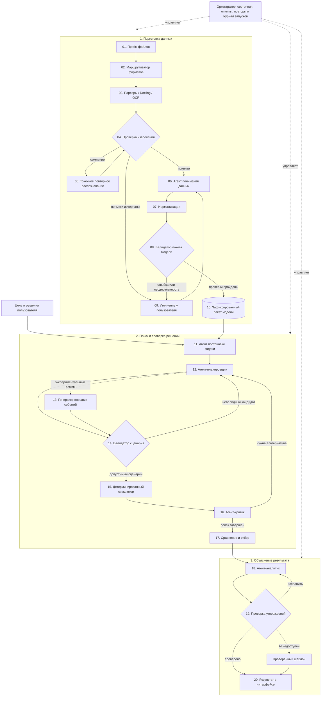

<div align="center">

# Аким на 5 часов

### Симулятор распределения городского бюджета для управленческих сценариев

**Статус:** выбран трек, реализация ещё не начата

[Задача](#задача) · [Основной сценарий](#основной-сценарий) · [Расчётная модель](#расчётная-модель) · [Агентная архитектура](#агентная-архитектура) · [План реализации](#план-реализации)

</div>

> **Зачем это нужно:** городские решения одновременно влияют на транспорт, экологию,
> социальную инфраструктуру, безопасность и городские сервисы. Проект должен помочь
> сравнить последствия пяти инициатив при едином ограниченном бюджете.

## Задача

Пользователь получает синтетические показатели пяти районов Астаны и виртуальный
бюджет в 100 единиц. Необходимо выбрать ровно пять мероприятий, соблюсти ограничения
и получить итоговый `Astana Quality of Life Score` с объяснением сильных сторон,
рисков и компромиссов сценария.

## Основной сценарий

| Шаг | Действие пользователя | Ожидаемый результат |
| --- | --- | --- |
| **1. Изучить город** | Сравнить исходные показатели районов | Видны слабые направления и критические значения |
| **2. Выбрать меры** | Добавить ровно пять инициатив | Система показывает стоимость и затронутые районы |
| **3. Проверить бюджет** | Подтвердить набор решений | Невалидный сценарий отклоняется с понятной причиной |
| **4. Запустить расчёт** | Передать допустимый сценарий модели | Рассчитываются новые показатели районов и итоговый Score |
| **5. Получить разбор** | Открыть результат | AI объясняет преимущества, риски и возможные улучшения |

## Обязательные требования

- единый бюджет — **100 условных единиц**;
- ровно **5 уникальных решений**;
- доступен выбор мероприятий по всем пяти направлениям городского развития;
- автоматическая проверка бюджета, повторов и несовместимостей;
- детерминированный расчёт `Astana Quality of Life Score`;
- AI-анализ результата без самостоятельного вычисления показателей;
- объяснение сильных сторон, рисков и последствий сценария.

## Расчётная модель

Официальный датасет и формула должны использоваться без скрытых изменений. Числовой
результат рассчитывается обычным кодом; AI получает готовые дельты и формирует только
понятное человеку объяснение.

```text
5 районов × 10 показателей
            ↓
5 выбранных мероприятий
            ↓
валидатор бюджета и ограничений
            ↓
эффекты с учётом лагов, синергий и конфликтов
            ↓
районные оценки → Astana Quality of Life Score
            ↓
AI-разбор сильных сторон, рисков и компромиссов
```

Базовое контрольное значение официальной модели: **52,56**. Контрольный сценарий из
задания должен давать результат около **56,54**; после реализации это будет закреплено
автоматическими тестами.

## Агентная архитектура

Архитектура разделяет вероятностные задачи AI и строгие операции. Агенты понимают
данные, предлагают сценарии, ищут слабые места и объясняют результат. Код проверяет
правила, выполняет преобразования и рассчитывает показатели. Ни один агент не может
текстом отменить ошибку валидатора или самостоятельно придумать числовой эффект.



### Ответственность узлов

| Контур | Что делает AI | Что остаётся детерминированным |
| --- | --- | --- |
| Подготовка данных | Понимает сущности, единицы, ограничения и предлагает сопоставление | Чтение структурированных файлов, разрешённые преобразования, проверка схемы и диапазонов |
| Поиск решений | Формулирует цель, предлагает кандидатов, критикует результат | Бюджет, повторы, направления, несовместимости и допустимость сценария |
| Симуляция | Не участвует в арифметике | Эффекты, лаги, синергии, `clip`, оценки районов и итоговый Score |
| Объяснение | Формирует разбор сильных сторон, рисков и компромиссов | Сверка чисел, ссылок на расчёт и валидности рекомендаций |

Все принятые данные фиксируются в каноническом пакете вместе с версиями и
происхождением полей. Один и тот же пакет, набор решений и версия движка должны давать
одинаковый расчёт. Универсальный импорт и генератор внешних событий являются
расширениями; основной конкурсный сценарий не зависит от них.

Архитектура пока является планом и будет уточнена после выбора технологического стека.

## Быстрый старт

Команды установки и запуска будут добавлены после появления первого запускаемого
прототипа. На текущем этапе репозиторий содержит только описание выбранного трека.

## План реализации

- [ ] Перенести официальный датасет в версионированный машиночитаемый формат.
- [ ] Реализовать валидатор пяти решений и бюджета.
- [ ] Реализовать формулу Score, лаги, синергии и несовместимости.
- [ ] Добавить тесты для базового и контрольного сценариев.
- [ ] Создать интерфейс выбора городских инициатив.
- [ ] Подключить AI-объяснение рассчитанного результата.
- [ ] Проверить запуск проекта в чистом окружении по README.

## Ограничения

Проект пока находится на этапе выбора трека: приложение, команды запуска, демо и
измеренные результаты отсутствуют. Технологический стек и состав команды будут указаны
после начала реализации.

## Критерии оценки

| Критерий | Вес | Что должно подтвердить результат |
| --- | ---: | --- |
| Соответствие задаче и работоспособность | 25 | Полный сценарий от выбора мер до объяснения Score |
| Техническая реализация | 25 | Проверяемая модель, валидатор и обоснованная роль AI |
| README и воспроизводимость | 25 | Чистый запуск и контрольный пример по документации |
| Ценность и применимость | 15 | Понятное сравнение управленческих компромиссов |
| Потенциал и оригинальность | 10 | Расширяемые сценарии без изменения официального Score |
