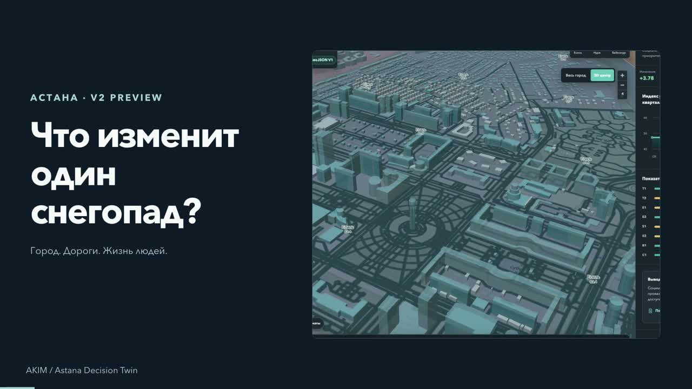

<div align="center">


# AKIM

### Проверяемая лаборатория бюджетных решений для городского управления

`Python 3.11+` · `FastAPI` · `React + TypeScript` · `Docker Compose`

[Запуск](#быстрый-старт) · [Демо](#демо-бэкенда) · [Архитектура](#архитектура) · [API](#api-first-контракты) · [Планы](#что-дальше)

</div>

> Городские решения конкурируют за один бюджет, а их эффект трудно проверить до
> запуска. AKIM рассчитывает **Astana Quality of Life Score (AQOL)** по условию
> «Аким на 5 часов» и показывает проверяемые причины изменения результата.

## AKIM в действии — видеообзор

Короткое знакомство с AKIM и интерфейсом городской лаборатории — за одну минуту.

[](assets/akim-video-overview.mp4)

**[▶ Смотреть видеообзор](assets/akim-video-overview.mp4)** · 60 секунд · Full HD

## Два режима

| | V1 · Задание хакатона | V2 · Исследовательская симуляция |
| --- | --- | --- |
| Вопрос | Как пять мер меняют заданный Score? | Как город развивается во времени при разных решениях? |
| Основа | 5 условных районов, 14 мер, бюджет 100 | Жители, инфраструктура, службы, городские финансы, внешняя экономика |
| Динамика | Итог по формуле с лагом | События, очереди, передвижения, проекты, сезонность |
| AI | Объясняет расчёт и исследует альтернативы | Помогает ставить эксперименты, общаться с агентами, анализировать процессы |
| Доказательство качества | Контрольные числа и тесты правил | Проверка механизмов, калибровка, исторические тесты, неопределённость |

V1 сохраняет исходные правила без изменений. V2 получает отдельные версии данных,
моделей и метрик. Модельные реакции жителей не меняют официальный Score V1.

## Текущий статус

Реализован **бэкенд V1**: API, evaluator, Data Gate, локальный поиск альтернатив,
отчёт с evidence. Фронтенд из актуального main подключён к API через адаптер;
Compose поднимает оба слоя. В этой ветке добавлен **бэкенд V2-demo**: отдельный
worker, PostgreSQL, события, часы, checkpoint/ветки, парные эксперименты и экспорт.
Интерфейс из `codex/aygerim-v2-preview` объединён с этим бэкендом: кнопка
«Снегопад · V2» запускает реальный worker через API. Остальные исследовательские
экраны пока остаются preview; расчёт V1 доступен по `/?mode=v1`. AI и альтернативы V1 пока доступны
через API/Swagger, но не подключены к кнопкам текущего интерфейса.
LLM-адаптер проверен тестовыми ответами; живой вызов провайдера в этом прогоне
**не выполнялся**. Без ключа явно возвращается `mode: rule-based`.

| Возможность | Реализация | Доказательство |
| --- | --- | --- |
| Расчёт AQOL | Эффекты, лаги, синергии, clip, штрафы и декомпозиция | Контрольный Score **56.54307** |
| Проверка портфеля | Ровно 5 уникальных мер, бюджет ≤100, ≤2 мер одного направления, районы и конфликты | Невалидный набор получает `score: null` |
| Data Gate → API | Исходник → quality report → опубликованный snapshot → evaluator | V1 закреплён за одним снимком |
| Альтернативы | Перебор одной замены меры/района; фиксация решений | Найден вариант **57.20556** за **100** |
| Объяснение | Сильные стороны, риски, последствия и проверенные предложения | Числа и формулировки берутся из серверного evidence |
| API-first | OpenAPI, проверка версий, структурные ошибки | HTTP integration tests |
| V2 «Снегопад» | 6 синтетических районов, транспортный спрос, бригады, очереди и обращения | `python -m scripts.demo_v2` |
| V2 лаборатория | Сохраняемые прогоны, идемпотентные команды, replay, ветки, парные seed | Экспорт manifest/state/events + интервалы различий |
| V2 стратегический прототип | Когорты и миграция, жильё, проекты, проводки, синтетические голосования | Балансы населения и денег; статус каждого модуля в `/v2/catalog` |

Полная исследовательская платформа из ТЗ **не объявляется завершённой**:
транспорт пока агрегированный, нет мультимодального графа, калибровки, модулей
озеленения/безопасности и полного десятилетнего политико-бюджетного сценария.
[Реализованное и ограничения V2](docs/V2-IMPLEMENTATION.md) ·
[Контракт для фронтенда](docs/V2-API.md).

## Быстрый старт

**Нужно:** запущенный Docker Desktop в режиме Linux containers (или Docker Engine)
с Docker Compose v2.20+ (или v5), Git и интернет для первой сборки. Python/Node на хосте
для этого способа не нужны. Объединённая версия находится в `main`:

```bash
git clone --branch main https://github.com/BAITC-Hacks/hack-d4922f7f-attractor.git
cd hack-d4922f7f-attractor
docker compose up --build -d --wait
```

После клонирования запуск всего проекта — **одна последняя команда**, без обязательного
`.env` и без ключей. Compose собирает `web` (React + nginx) и `api` (FastAPI +
engine + Data Gate), `worker` V2 и `db` (PostgreSQL); ждёт healthcheck.
База не публикует порт на хост. Для стабильного V1 без V2 сохранена ветка `fix/backend-readiness`.

| Куда открыть | Что находится |
| --- | --- |
| [localhost:8080](http://localhost:8080) | Новый интерфейс: API V1 и реальный прогон «Снегопад · V2»; mock-элементы подписаны |
| [localhost:8080/?mode=v1](http://localhost:8080/?mode=v1) | Полный калькулятор V1: выбор пяти мер, валидация и расчёт |
| [localhost:8000/docs](http://localhost:8000/docs) | Swagger: расчёт, альтернативы, анализ и Data Gate |
| [localhost:8000/health](http://localhost:8000/health) | Готовность бэкенда и версии снимка |
| [localhost:8000/v2/catalog](http://localhost:8000/v2/catalog) | V2: снимок, параметры, единицы, ограничения модулей |
| [localhost:8000/v2/health](http://localhost:8000/v2/health) | Heartbeat отдельного worker V2 |

В новом интерфейсе выберите «Снегопад · V2» и дождитесь `360 / 360 мин · completed`.
Для V1 откройте «Расчёт V1» → «Загрузить контрольный сценарий» → «Рассчитать»:
ожидаемый Score — **56.54307**.

Проверьте сквозной сценарий (каталог → расчёт → альтернативы → отчёт):

```bash
docker compose exec -T api python -m scripts.demo_backend
docker compose exec -T api python -m scripts.demo_backend --url http://web/api
docker compose exec -T api python -m scripts.demo_v2
```

Вторая команда проверяет также nginx-прокси, которым пользуется браузер.
Ожидается `score: 56.54307`, `cost: 95`, `analysisMode: rule-based`.
Третья воспроизводит снегопад, ветку с переброской бригады, сравнение по трём seed,
evidence-отчёт и проверяет ZIP-экспорт. Она не вызывает платный LLM.

<details>
<summary>Настройки, логи, остановка и повторный запуск</summary>

Необязательная настройка: скопируйте [.env.example](.env.example) в `.env`
(PowerShell: `Copy-Item .env.example .env`; Linux/macOS: `cp .env.example .env`).
Если файл уже есть, отредактируйте его — не перезаписывайте секреты.

`AKIM_WEB_PORT` и `AKIM_API_PORT` меняют порты хоста (по умолчанию 8080 и 8000).
Например, если порт занят, задайте в `.env` `AKIM_WEB_PORT=8081` или `AKIM_API_PORT=8001`.
Внутри контейнеров адреса не меняются. После изменения `.env` повторите команду запуска.
Compose подставляет параметры из `.env`; переменные оболочки имеют приоритет.

```bash
docker compose ps
docker compose logs --tail=100 api worker db
docker compose down
docker compose up --build -d --wait
```

`down` останавливает контейнеры, **но сохраняет данные** в named volumes `data-gate` и `v2-postgres`.
Не добавляйте `-v`, если снимки/импорты нужны: `docker compose down -v` удаляет их.
Не запускайте несколько API workers или параллельный CLI writer на этом volume.
API работает от непривилегированного пользователя; наружу порты привязаны только к localhost.

Если Docker недоступен, сначала запустите Docker Desktop и проверьте `docker version`.
Если healthcheck не проходит, посмотрите `docker compose logs api`.
Подложка карты загружается из внешнего сервиса и требует интернета; расчёт выполняет
локальный API. Первая сборка скачивает образы, npm- и Python-зависимости.

</details>

### Запуск без Docker

Нужно: Python **3.11+**, доступ к PyPI для установки. БД и ключ LLM для demo не нужны.
Из корня клонированного [репозитория](https://github.com/BAITC-Hacks/hack-d4922f7f-attractor),
PowerShell:

```powershell
python -m venv .venv
.venv/Scripts/python -m pip install -c requirements.lock ".[test]"
.venv/Scripts/python -m unittest discover -s tests -t .
.venv/Scripts/python -m uvicorn services.api.app:app --host 127.0.0.1 --port 8000
```

<details>
<summary>Linux / macOS</summary>

```bash
python3 -m venv .venv
.venv/bin/python -m pip install -c requirements.lock ".[test]"
.venv/bin/python -m unittest discover -s tests -t .
.venv/bin/python -m uvicorn services.api.app:app --host 127.0.0.1 --port 8000
```

</details>

[Swagger UI](http://127.0.0.1:8000/docs) · [Каталог](http://127.0.0.1:8000/catalog).
API сам импортирует и публикует официальный исходник. Хранилище:
`var/data-gate` относительно текущего каталога. Запускать **один worker**.
Для V2 запустите **ещё один терминал из того же каталога**:
`.venv/Scripts/python -m engine.v2.infrastructure.worker`
(Linux/macOS: `.venv/bin/python -m engine.v2.infrastructure.worker`).
Без `AKIM_DATABASE_URL` API и worker используют локальный SQLite-файл
`var/v2/state.sqlite3`; в Compose всегда используется PostgreSQL.
`AKIM_RUN_TOKEN` защищает изменяющие V2-запросы; пустое значение допустимо только
для локального однопользовательского демо. `AKIM_ADMIN_TOKEN` отдельно защищает Data Gate.
Это запуск только API. Для локальной разработки интерфейса дополнительно нужны
Node.js 22 и npm: в `apps/web` выполните `npm ci` и запустите `npm run dev` с
`VITE_API_PROXY=true` в окружении. Без этого переключателя калькулятор `/?mode=v1`
использует fixtures; новый preview всегда обращается к локальному API через `/api`.
В Compose нужный адрес `/api` встраивается автоматически при сборке.
Основная точка входа — `services.api.app:app`; старый `api.main` оставлен как legacy,
Compose его не запускает. Прототип `api/v2.py` из preview-ветки также сохранён как legacy:
он не подключён к production-router и не подменяет сохраняемые прогоны V2.

## Демо бэкенда

Во втором терминале, пока сервер запущен:

```powershell
.venv/Scripts/python -m scripts.demo_backend
```

Проверяются каталог/версии → контрольный расчёт → отказ неполному набору →
альтернативы → evidence-backed report. Сохранённый реальный HTTP-прогон:
[backend-demo.json](docs/evidence/backend-demo.json).

Для `POST /v1/evaluate` в Swagger:

```json
{
  "selections": [
    {"measureId": "M7", "districtId": "nura"},
    {"measureId": "M8", "districtId": "nura"},
    {"measureId": "M10", "districtId": "nura"},
    {"measureId": "M12", "districtId": null},
    {"measureId": "M5", "districtId": "saryarka"}
  ]
}
```

Результат: `valid: true`, `cost: 95`, `score: 56.54307`. `aqolScore` — алиас Score.
Для интеграции передавайте также `versions` целиком из `GET /catalog`.

## Архитектура

| Слой | Ответственность | Реализация |
| --- | --- | --- |
| Аким / API | HTTP, доступ к импорту, версии, сборка use cases | `services/api` |
| Город | Валидация, точный расчёт, локальные альтернативы | `engine/v1` |
| Динамический город | Временные переходы, ledger, очереди, когорты, проекты | `engine/v2/domain` |
| Прогоны и лаборатория | Команды, checkpoint, replay, ветвление, ансамбли | `engine/v2/application` |
| Worker и хранилище | Отдельный процесс, атомарные пакеты, PostgreSQL; локально SQLite | `engine/v2/infrastructure` |
| Данные | Парсеры, паспорт, quality gate, snapshots, lineage | `data_gate` |
| AI-аналитик | Выбор подтверждённых фактов, read-only tools, fallback | `ai` |

Домен/application движка не импортируют FastAPI, OpenAI SDK или Data Gate.
Composition root `services/api/runtime.py` переводит опубликованный payload в
immutable модель. Пользовательские импорты не подменяют официальный V1.
`create_official_service()` оставлен как загрузчик эталонного fixture.

Брифы для будущих изображений: [README-VISUALS.md](docs/README-VISUALS.md).
Целевая архитектура с V2: [docs/02-architecture.md](docs/02-architecture.md).

## Как считается V1

```text
I′ = clip(I + Σ effect × (8 − lag) / 8 + synergy, 0, 100)
Ddistrict = Σ weight × I′
Score = 0.7 × Davg + 0.3 × min(Ddistrict) − Ncritical
```

Нужно **ровно пять мер, не больше двух одного направления**, а не по одной каждой
категории. Промежуточные значения не округляются. Критичность — строго ниже 40;
остаток бюджета бонуса не даёт. LLM не считает Score.
[Полная спецификация](docs/03-v1-reference-model.md).

## Проверенные результаты

Локально: Windows/Python 3.12.10; проверены Linux-контейнеры через Docker Desktop.
CI для Python 3.11/3.12 и Compose добавлен; удалённый результат пока не подтверждён.

| Проверка | Результат |
| --- | --- |
| Автотесты | **140 Python** (139 общий запуск + 1 новый контрактный отдельно), **3 Node**; без многократного полного прогона |
| База без мер (диагностика) | **52.55768** |
| Контрольный портфель за 95 | **56.54307** |
| Декомпозиция прироста | **+0.85064 +1.13475 +2 = +3.98539** |
| Лучшая найденная локальная альтернатива | **57.20556**, стоимость **100** |
| Официальный импорт | **0 critical / 0 warning** |
| Установка | `pip install`, сборка wheel, ресурсы и HTTP smoke вне checkout |
| Статические проверки | Ruff, `pip check`, синхронизация OpenAPI |
| Docker Compose | API, worker, PostgreSQL и web healthy; V1 через nginx и V2 HTTP-demo прошли |
| V2, три парных seed | Медиана изменения `service-unavailability-hours`: **−68.8702**, p05…p95 **−70.8670…−63.4259**; дополнительный расход **5 000 модельных KZT** |

V2-числа — результат **синтетического** опыта за 840 модельных минут, а не прогноз
реального города. Интервал по трём seed иллюстрирует воспроизводимость, но слишком мал
для исследовательского вывода. Полный протокол и исходы: [v2-demo.json](docs/evidence/v2-demo.json).
Бюджет выполним в обеих ветках; равенство фактических расходов **не заявляется**.

## API-first контракты

| Endpoint | Назначение |
| --- | --- |
| `GET /health`, `GET /catalog` | Готовность, каталог, правила, версии, manifest |
| `POST /v1/validate` | Валидация без LLM |
| `POST /v1/evaluate` | Расчёт; неправильный портфель → 200 с `valid: false` |
| `POST /v1/alternatives` | Одна замена; `fixedSelections`, `allowedDistricts`, `resultLimit` |
| `POST /v1/analysis` | Отчёт с evidence, явными `mode` и статусом fallback |
| `POST /datasets/imports` | Текстовый импорт с паспортом; admin token |
| `GET /datasets/imports/{id}/report` | Report, mapping, preview; admin token |
| `POST /datasets/imports/{id}/publish` | Публикация с принятием warnings; admin token |
| `GET /datasets` | Наборы и manifest; admin token |
| `GET /v2/catalog`, `GET /v2/health` | Данные/допущения V2 и состояние worker |
| `POST /scenarios`, `POST /runs` | Immutable-сценарий и отдельный прогон с seed |
| `POST /runs/{id}/commands` | Часы и управленческие решения; версия и idempotency key |
| `POST /runs/{id}/checkpoints`, `/branches`, `/replay` | Сохранение, ветки и проверка воспроизводимости |
| `GET /runs/{id}/events`, `/metrics`, `/trace/{eventId}` | SSE с cursor, ряды, evidence и причинная трасса |
| `GET /runs/{id}/population`, `/development`, `/flows`, `/politics` | Стратегические подсистемы и проводки |
| `POST /experiments`, `GET /experiments/{id}` | Асинхронные парные ансамбли; эмпирические интервалы |
| `POST /assistant/messages`, `GET /runs/{id}/export` | Rule-based evidence-отчёт V2 и ZIP воспроизведения |

Неверная структура → 422; устаревшие версии / запрещённая публикация → 409;
нет доступа → 403; body >1 200 000 байт → 413.
Ошибки: `error: {code, field, message}`.
[Контракты и расхождения с черновым frontend-клиентом](packages/contracts/README.md).

## AI и конфигурация

LLM выбирает/упорядочивает готовые evidence IDs. Сервер проверяет категорию,
обязательные риски и полноту, затем подставляет собственные числа и фразы.
Это ограниченный evidence-аналитик, не свободный городской агент.
Невалидный ответ: один repair, затем шаблон. Ошибка провайдера не ломает расчёт.

| Переменная | Назначение |
| --- | --- |
| `AKIM_WEB_PORT`, `AKIM_API_PORT` | Порты Compose на localhost: по умолчанию 8080 и 8000 |
| `AKIM_DATA_GATE_DIR` | Путь при прямом Python-запуске; Compose фиксирует путь persistent volume |
| `AKIM_CORS_ORIGINS` | Разрешённые адреса UI через запятую; по умолчанию закрыто |
| `AKIM_ADMIN_TOKEN` | Bearer token для Data Gate; без него HTTP-доступ закрыт |
| `AKIM_RUN_TOKEN` | Bearer token для управления V2; пустой только для локального demo |
| `AKIM_DB_PASSWORD` | Пароль внутренней PostgreSQL Compose; demo-default не для production |
| `AKIM_DATABASE_URL`, `AKIM_V2_STORE` | PostgreSQL URL либо SQLite-файл при запуске без Compose |
| `AKIM_CODE_REVISION` | Метка сборки/commit в manifest; задайте при выпуске |
| `AKIM_LLM_ENABLED=1` | Явное включение платных запросов |
| `OPENAI_API_KEY`, `OPENAI_MODEL` | Ключ и доступная Responses-модель с tools/structured outputs |
| `AKIM_LLM_MAX_ANALYSES` | Анализов на процесс: по умолчанию 10, максимум 100 |

[.env.example](.env.example) — шаблон для необязательного `.env`. **Compose читает
`.env` автоматически**, прямой Python — нет (экспортируйте переменные в оболочку).
Ключи не коммитьте: `.env` исключён из Git и Docker build context. Лимиты LLM: один одновременный
анализ, deadline 20 секунд, ≤3 вызовов включая repair, ≤800 output tokens/вызов;
SDK retries отключены. Это не денежный лимит: настройте бюджет проекта провайдера.

## Data Gate

Поддержаны исходник задания, City JSON, GeoJSON WGS84, синтетический V2 City,
CSV/XLSX/JSON для нормализованных наблюдений с единицами, provenance и тремя временами.
Это определённые схемы, не автоматическое понимание произвольной таблицы. Дубли JSON-ключей,
NaN/Infinity, неверные типы/даты/ссылки не исправляются молча. Критические ошибки
блокируют публикацию; checksum staging и snapshot проверяется при чтении.
Идентичность импорта учитывает байты, формат, паспорт и transform version.

```powershell
.venv/Scripts/python -m data_gate --store var/data-gate bootstrap
```

[CLI и правила миграции](data_gate/README.md).

## Структура проекта

```text
engine/v1/          правила, evaluator, application service, локальный search
engine/v2/domain/   scheduler и чистые переходы синтетического города
engine/v2/application/ прогоны, команды, checkpoint, ветки, replay, эксперименты
engine/v2/infrastructure/ Data Gate adapter, PostgreSQL/SQLite, отдельный worker
data_gate/          import, quality, snapshots, файловые/in-memory adapters, CLI
services/api/       HTTP-модели, маршруты, доступ, composition root
ai/                 evidence policy и Responses adapter
packages/contracts/ domain JSON Schema и генерируемый OpenAPI
data/               исходник и эталонный fixture (входят в wheel)
tests/              golden, regression, integration, search, AI contract tests
scripts/            HTTP demo, OpenAPI export, wheel smoke
apps/web/           React UI и адаптер HTTP-контрактов
compose.yaml        API + worker + PostgreSQL + существующий web; volumes и healthchecks
deploy/             nginx reverse proxy для web → API
docs/               спецификации, аудит, evidence
assets/             логотип и будущие изображения README
```

## Что дальше

**Перед защитой:** подключить кнопки AI/альтернатив, записать демо, проверить живую LLM-модель
и сравнить пользу с rule-based baseline, получить зелёный CI. Сроки не зафиксированы.

**Следующий этап:** расширить `engine/v2/domain` графом маршрутов и полным бюджетным
циклом; вынести event log из JSON-документа в отдельную PostgreSQL-таблицу, добавить
RBAC и измерить задержки на длинном горизонте. Очередь, worker и replay уже есть.

**Дальше:** реальные разрешённые данные, калибровка/holdout, новые `SourceParser`
adapters и анализ параметрической неопределённости поверх ансамблей V2.
Первое ограничение роста — размер полного run-документа и журналов; масштабирование
обосновывается измерениями, не числом нарисованных агентов.

## Ограничения

- V1 — синтетическое задание, не прогноз и не доказательство причинного эффекта.
- Поиск локальный: глобальный максимум не заявляется.
- Live LLM и пользовательские исследования не подтверждены этим прогоном.
  UI собирается и связан с API; это ещё не полная UX-приёмка.
- V2 — **частичный V2-demo**, не полная реализация всех MUST ТЗ. Коридорное время
  поездки — модельный proxy, не измеренный P90; интервалы seed не являются confidence interval.
  В стратегическом режиме услуги агрегируются по суткам, месяц равен 30 дням.
  Субсуточную погоду проверяйте в оперативном режиме.
- Файловый Data Gate: один процесс-писатель; не запускайте CLI/API одновременно
  на одном хранилище. Lock API не заменяет межпроцессные транзакции.
- Нет готового публичного production deployment, RBAC, постоянного бюджета LLM
  или нагрузочного отчёта. Compose — локальный demo-профиль, не production.
- `npm audit` обнаруживает critical XSS в пришедшем из main `maplibre-gl@5.24.0`
  ([GHSA-jrc7-96c5-q579](https://github.com/maplibre/maplibre-gl-js/security/advisories/GHSA-jrc7-96c5-q579)).
  Исправление начинается с 6.4.1; перед публичным показом нужен проверенный major upgrade.
  Внешний стиль карты использует затронутый attribution-путь; localhost не устраняет XSS.
- Отдельная лицензия и состав команды пока не опубликованы.

## Документация

[Продукт](docs/01-product.md) · [Архитектура](docs/02-architecture.md) ·
[V1](docs/03-v1-reference-model.md) · [V2](docs/04-v2-simulation.md) ·
[Данные](docs/05-data-gate.md) · [AI](docs/06-ai-and-interactions.md) ·
[Исследования](docs/07-research-validation.md) · [План](docs/08-delivery-plan.md).

Оценка по обеим рубрикам, исправления и приоритеты:
[BACKEND-AUDIT.md](docs/BACKEND-AUDIT.md).

Данные предоставлены в [условии задачи](data/source-dataset.ru.txt).
«Исследовательская платформа» означает воспроизводимые гипотезы и прозрачные
допущения, а не подтверждённую точность на реальном городе.
