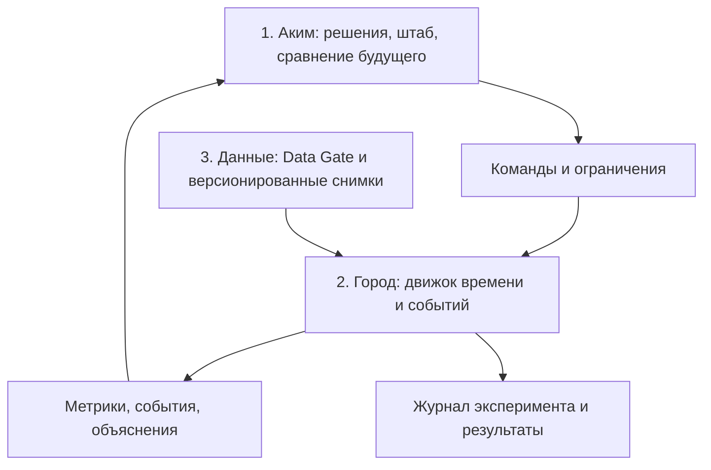

# AKIM — лаборатория управления городом

План двух версий проекта «Аким на 5 часов»: проверяемый симулятор бюджетных решений
и исследовательская платформа динамической агентной симуляции города.

**Статус: проектирование.** В репозитории находятся исходный датасет и технический
план. Работающего приложения, обученной модели и подтверждённой точности прогнозов
пока нет. Ниже описан целевой продукт, а не уже реализованные возможности.

## Два режима

| | V1 · Задание хакатона | V2 · Исследовательская симуляция |
|---|---|---|
| Вопрос | Как пять мер меняют заданный Score? | Как город развивается во времени при разных решениях? |
| Основа | 5 условных районов, 14 мер, бюджет 100 | Жители, инфраструктура, службы, городские финансы, внешняя экономика |
| Динамика | Итог по формуле с лагом | События, очереди, передвижения, проекты, сезонность |
| AI | Объясняет расчёт и исследует альтернативы | Помогает ставить эксперименты, общаться с агентами, анализировать процессы |
| Доказательство качества | Контрольные числа и тесты правил | Проверка механизмов, калибровка, исторические тесты, неопределённость |

V1 сохраняет исходные правила без изменений. V2 получает отдельные версии данных,
моделей и метрик. Модельные реакции жителей не меняют официальный Score V1.

## Три слоя

## Полный план

1. [Продукт, границы и пользовательские сценарии](docs/01-product.md).
2. [Архитектура трёх слоёв и API](docs/02-architecture.md).
3. [V1: точная спецификация и контрольные расчёты](docs/03-v1-reference-model.md).
4. [V2: динамика города, агенты и пять подсистем](docs/04-v2-simulation.md).
5. [Data Gate: данные, контракты и качество](docs/05-data-gate.md).
6. [AI, NPC, обращения и управленческий штаб](docs/06-ai-and-interactions.md).
7. [Научная проверка и протокол экспериментов](docs/07-research-validation.md).
8. [Этапы, backlog, приёмка и демонстрация](docs/08-delivery-plan.md).
9. [Исходное условие и датасет](data/source-dataset.ru.txt).

## Что должно появиться первым

Сначала запускаемый V1: выбор пяти решений → серверная проверка → точный расчёт →
AI-объяснение. Затем V2 на одном воспроизводимом сценарии: снегопад → транспорт и
службы → обращения → реакция акима → сравнение с веткой без вмешательства.

Базовый Score: **52.55768**. Контрольный набор стоимостью 95: **56.54307**.
Точная спецификация и смысл этих чисел приведены в документе V1.

## Воспроизводимость

Команды запуска будут добавлены вместе с исполняемым приложением. Необходимые для
будущего релиза артефакты: lock-файлы, контейнеры, `.env.example`, seed-данные,
миграции, автоматические тесты, manifest эксперимента и экспорт результатов.
Планируемый стек: React/TypeScript, Python/FastAPI, PostgreSQL/PostGIS; обоснование
и границы модулей — в архитектуре. Выбор зависимостей закрепляется ADR и lock-файлами.

Термин «исследовательский уровень» здесь означает проверяемые гипотезы, прозрачные
допущения, воспроизводимость и измеренную ошибку. Он не означает аффилиации с MIT,
сертификации или уже доказанной точности модели.
