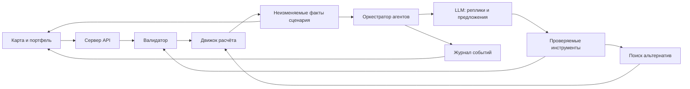

# Продукт и архитектура

## 1. Обещание продукта

«Примите пять решений, поговорите с городом о последствиях и проверьте другое будущее».

MVP — лаборатория сценариев на синтетических данных. Это не валидированный цифровой
двойник Астаны и не прогноз реального поведения населения.

Вдохновение: [MiroFish](https://github.com/666ghj/MiroFish): персонажи с памятью,
взаимодействие и диалог после симуляции. Интеграция самого проекта не является
зависимостью MVP. Графы хранятся в JSON/таблицах; отдельная графовая БД не нужна.

## 2. Обязательный вертикальный срез

1. Карта пяти районов и исходная тепловая таблица 5 × 10.
2. Все 14 мероприятий, выбор территории, бюджет 100, ровно пять решений.
3. Клиентская подсказка и независимая серверная валидация.
4. Детерминированный расчёт Score и объяснение его изменения.
5. Синтетические жители обсуждают фактические последствия.
6. Аналитик предлагает допустимую альтернативу через инструмент поиска.
7. Ветки A/B сравниваются по одинаковым исходным условиям.
8. Пользователь задаёт вопрос персонажу; ответ привязан к фактам выбранной ветки.

Расчёт доступен без LLM. При недоступности модели показывается фактический отчёт
и явный статус «AI-обсуждение недоступно». Сохранённый прогон обозначается как запись.

## 3. Визуальная структура

- Центр: стилизованная карта районов; выбранные объекты, цвет показателей, клики по районам.
- Слева: каталог, пять слотов решений, стоимость и конфликты.
- Справа: 6–10 значимых событий обсуждения с кнопкой «Почему?».
- Снизу: фазы «Ожидания / Последствия / Альтернативы», запуск и сравнение A/B.
- Экран результата: Score, составляющие прироста, критические показатели, нерешённые проблемы.

Геометрия карты условная; не выдавать её за точные административные границы.
До пяти решений можно показывать только предварительный расчёт с соответствующей меткой.

## 4. Архитектура



Для скорости: один репозиторий, один сервер, один клиент, одна простая БД или файловое
хранилище для MVP. Конкретный язык выбирается по привычному стеку команды в первые
20 минут. API-контракты ниже независимы от этого выбора. Ключ LLM хранится только на сервере.

Предлагаемые логические модули:

```text
data/       districts, measures, rules, personas, graph
engine/     validate, simulate, explain, optimize
agents/     state, prompts, tools, orchestrator, grounding
api/        scenarios, runs, events, comparisons, chat
ui/         map, portfolio, event-feed, comparison
tests/      golden-results, validation, isolation, integration
```

## 5. Контракты

```typescript
type DistrictId = "esil" | "almaty" | "saryarka" | "baikonur" | "nura";
type IndicatorId = "T1" | "T2" | "E1" | "E2" | "S1" | "S2" | "B1" | "B2" | "C1" | "C2";
type Selection = { measureId: string; districtId: DistrictId | null };
type Scenario = {
  id: string; parentScenarioId: string | null;
  datasetVersion: string; rulesVersion: "portfolio-v1" | "all-directions-v1";
  seed: number; selections: Selection[];
};
type ValidationIssue = { code: string; selectionIds: string[]; message: string };
type Result = {
  scenarioId: string; valid: boolean; issues: ValidationIssue[];
  cost: number; remainingBudget: number;
  score: number | null; // null для невалидного официального сценария
  districtScores: Record<DistrictId, number> | null;
  indicators: Record<DistrictId, Record<IndicatorId, number>> | null;
  average: number | null; minimum: number | null; criticalCount: number | null;
  facts: Fact[];
};
type Fact = {
  id: string; scenarioId: string; kind: string;
  districtId: DistrictId | null; indicatorId: IndicatorId | null;
  before: number | null; after: number | null;
  measureIds: string[]; description: string;
};
type SimulationEvent = {
  id: string; runId: string; scenarioId: string; branchId: string;
  seq: number; round: number; actorId: string;
  type: "observation" | "appeal" | "reply" | "proposal" | "validation" | "report";
  text: string; factIds: string[]; respondsTo: string[];
  epistemicStatus: "calculated" | "interpretation" | "hypothesis";
};
```

Fact ID уникален внутри неизменяемого сценария; результат нового набора мер создаёт
новый scenarioId. Нельзя исправлять факты существующей ветки на месте.

Предлагаемые endpoints:

| Метод | Назначение |
|---|---|
| GET /api/catalog | Версии данных, районы, мероприятия, ограничения |
| POST /api/scenarios/validate | Валидация без LLM |
| POST /api/scenarios | Валидация, расчёт, сохранение сценария |
| POST /api/scenarios/:id/runs | Запуск обсуждения; сразу возвращает runId |
| GET /api/runs/:id/events | SSE-поток с seq; восстановление после обрыва |
| POST /api/scenarios/:id/alternatives | Проверенные альтернативы с ограничениями |
| POST /api/comparisons | Сравнение двух совместимых сценариев |
| POST /api/runs/:id/agents/:agentId/chat | Диалог в контексте выбранной ветки |

Ошибки и отмена имеют явные статусы; повторный запрос запуска с тем же ключом
идемпотентности не создаёт вторую симуляцию. Ответ AI с несуществующим factId
отклоняется или перегенерируется один раз, затем заменяется шаблоном.

## 6. Инструменты AI

| Инструмент | Вход | Выход |
|---|---|---|
| inspect_district | scenarioId, districtId | Проверенные показатели и факты |
| validate_plan | selections, rulesVersion | Все нарушения, стоимость |
| simulate_plan | selections, versions | Полный результат без LLM |
| search_alternatives | scenarioId, constraints, limit | Только валидные планы и результаты |
| compare_plans | scenarioA, scenarioB | Дельты, критические значения, бюджет |

Ограничения поиска: закреплённые меры и территории, максимальные расходы,
минимум по конкретному показателю, число допустимых замен. Неразрешимые ограничения
возвращают пустой список с объяснением; агент не ослабляет их без решения пользователя.
Инструменты не публикуют сообщения и не применяют решения от имени пользователя.

## 7. Воспроизводимость и честность

- Формула, каталог, правила, профили и социальный граф версионируются.
- Порядок мер не влияет на расчёт. Хеш набора строится после канонической сортировки.
- Сохраняются seed, версия модели/промпта, tool calls и полные выходы агентов.
- Seed обеспечивает повторяемость заданных случайных процедур, но не обещает идентичный LLM-текст.
- Точное воспроизведение обсуждения использует сохранённый журнал.
- Ветки используют одинаковые профили и стартовую память. Память A не перетекает в B.
- Соревновательный рейтинг сравнивает только один datasetVersion/rulesVersion.
- Реальные минуты поездки, число ДТП, больничные очереди не выводятся из индексной шкалы.

## 8. За пределами MVP

Тысячи агентов, импорт документов, автоматическое построение GraphRAG, точная 3D-карта,
миграция населения, экономика недвижимости, случайные катастрофы, прогноз голосования.
Расширение модели допустимо позже как отдельная версия с собственными тестами.
