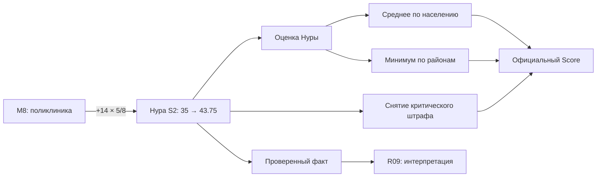
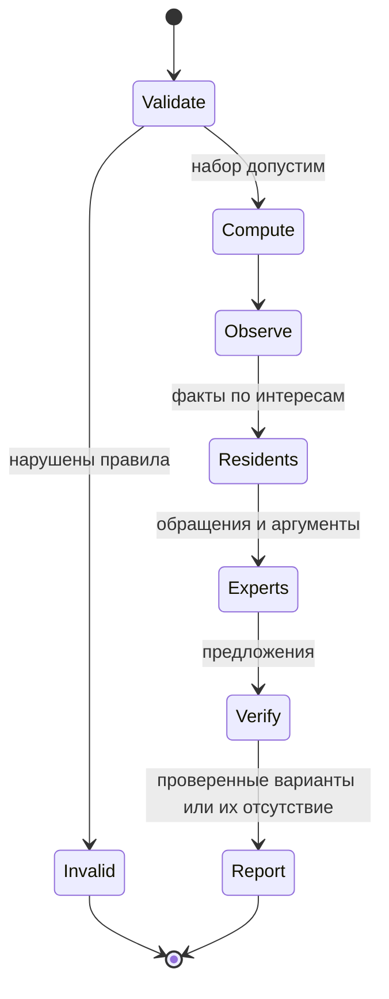
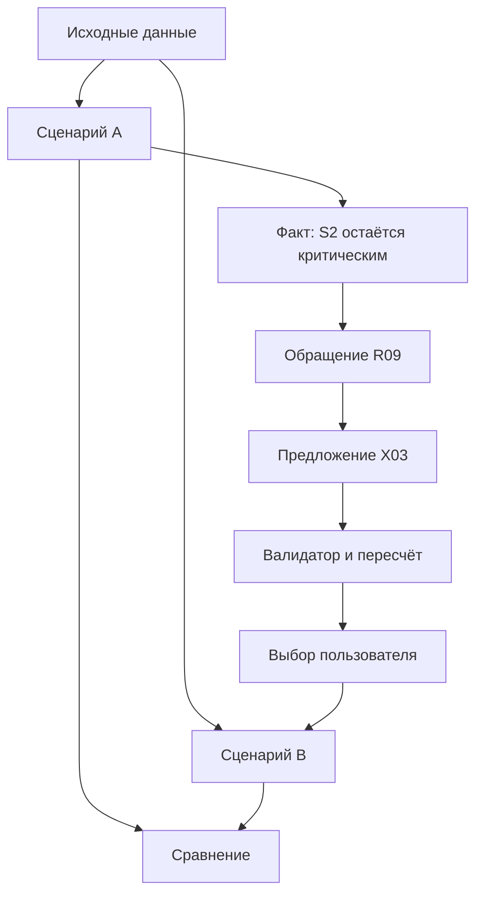

# Агенты, память и графы

## 1. Реестр: 10 жителей + 5 экспертов

Все персонажи вымышленные. Они представляют интересы, а не статистическую выборку.
Свойства не выводятся из пола, национальности или иных чувствительных характеристик.
Веса ниже — проектные гиперпараметры v1, не эмпирические оценки. В строке сумма равна 1.

| ID | Район / роль | Приоритеты q(a,k) | Типичное обращение |
|---|---|---|---|
| R01 | Есиль, родитель | S1 .50, T2 .30, B2 .20 | Социальная инфраструктура и безопасная дорога |
| R02 | Есиль, водитель | T1 .60, B2 .30, E2 .10 | Пробки и безопасность движения |
| R03 | Алматы, пожилой житель | S2 .45, C1 .40, T2 .15 | Медпомощь и коммунальная надёжность |
| R04 | Алматы, пассажир автобуса | T2 .60, T1 .25, B2 .15 | Доступность транспорта |
| R05 | Сарыарка, житель частного сектора | E2 .60, C1 .30, E1 .10 | Воздух и коммунальные услуги |
| R06 | Сарыарка, житель рядом с двором | E1 .50, B1 .30, S1 .20 | Зелень и общественная инфраструктура |
| R07 | Байконур, пешеход | B1 .40, B2 .40, T2 .20 | Безопасность и транспорт |
| R08 | Байконур, заявитель в городские службы | C2 .60, C1 .25, B1 .15 | Обращения и качество обслуживания |
| R09 | Нура, родитель | S1 .45, S2 .35, T2 .20 | Два критических социальных показателя |
| R10 | Нура, работающий пассажир | T2 .50, S2 .30, C1 .20 | Транспорт и первичная медицина |
| X01 | Транспортный эксперт | T1, T2, B2 | Предлагает транспортные альтернативы |
| X02 | Экологический эксперт | E1, E2, C1 | Анализирует воздух и зелёные зоны |
| X03 | Социальный эксперт | S1, S2 | Проверяет дефицит и смысл эффектов |
| X04 | Эксперт безопасности | B1, B2 | Проверяет риски и перекрёстные эффекты |
| X05 | Аналитик бюджета и городских сервисов | Бюджет, C1, C2, Score | Проверяет наборы и ищет альтернативы |

Оркестратор — программная машина состояний, а не шестой эксперт. Итоговый отчёт
может формироваться отдельным LLM-вызовом с ролью составителя без собственной позиции.

## 2. Состояние и память

```typescript
type AgentState = {
  agentId: string; scenarioId: string; runId: string;
  districtId: string | null; role: "resident" | "expert";
  priorities: Record<string, number>;
  utilityBefore: number | null; utilityAfter: number | null;
  stance: "support" | "concern" | "mixed" | "neutral";
  visibleFactIds: string[];
  memoryEventIds: string[];
  unresolvedIssueKeys: string[];
  lastProposalId: string | null;
};
```

Три вида памяти:

1. Неизменяемый профиль: район, интересы, допустимые действия.
2. Эпизодическая память: последние шесть релевантных событий текущего прогона.
3. Структурная память: открытые проблемы и проверенные предложения со ссылками на факты.

Для MVP не нужна векторная БД. Получать факты по районным и индикаторным ключам,
память — по eventId. Сводка свободным текстом не заменяет факты.
LLM не редактирует q, официальные показатели, бюджет и результаты инструментов.

## 3. Четыре разных графа

Не смешивать граф формулы и граф общения. Ребро «обсуждает» не означает причинного
влияния на городской показатель.

### A. Граф расчёта и происхождения фактов

Узлы: Measure, DistrictIndicator, DistrictScore, CityScore, Rule, Fact.
Рёбра: AFFECTS, TARGETS, REQUIRES_PAIR, CONFLICTS_WITH, CONTRIBUTES_TO, DERIVED_FROM.



Алгоритм расчёта использует данные каталога; граф служит объяснению и навигации.
CONFLICTS_WITH хранит scope: global или same_district. Синергия моделируется
отдельным узлом с двумя входами, чтобы не включать бонус при одной мере.
Не добавлять несуществующие причинные рёбра «парк → цены квартир» или «камеры → минус 20% ДТП».

### B. Социальный граф

Узлы: жители и эксперты. Рёбра направленные: вес показывает внимание получателя
к сообщению отправителя. Это коэффициент модели, не измеренное доверие населения.

Правило v1 для получателя-жителя:

- соседний персонаж того же района: сырой вес 2;
- один персонаж другого района с максимальным косинусным сходством q: вес 1;
- эксперт с максимальной суммой приоритетов жителя по своей сфере: вес 2;
- одинаковые кандидаты объединяются, self-edge запрещён;
- нормировать входящие веса до суммы 1; ничьи разрешать по agentId.

Для экспертов обращения маршрутизируются по показателям, без социального усреднения.
X05 получает предложения всех экспертов. Граф строится один раз, сохраняется и одинаков для A/B.

### C. Граф выполнения



Пользователь может создать новую ветку из Report. Автоматического бесконечного
цикла «агенты спорят до согласия» нет. Максимум два раунда обсуждения и ограниченное
число tool calls; отмена прерывает незавершённые запросы.

### D. Граф сценариев и аргументов

Scenario A → fork → Scenario B; каждая ветка ссылается на один baseline.
Внутри ветки: Fact → Appeal → Proposal → Validation → Decision.



При переключении A/B показывать одному персонажу контекст нужной ветки. В режиме
явного сравнения агент получает факты обеих веток с разными идентификаторами.

## 4. Планировщик раундов

1. Валидировать, рассчитать и сохранить факты до первого LLM-вызова.
2. Рассчитать локальные utilities и затронутость всех десяти жителей детерминированно.
3. Выбрать до пяти говорящих: сначала новые/сохранившиеся критические проблемы,
   затем величина изменения utility; при равенстве agentId. Включить разные районы.
4. Параллельно получить их структурированные обращения.
5. После барьера раунда маршрутизировать обращения по социальным/экспертным рёбрам.
6. Запустить до трёх релевантных экспертов, затем X05 для проверки предложений.
7. Выдать не более трёх валидных альтернатив; повторяющиеся наборы объединить.
8. Один короткий раунд ответов жителей на предложения, затем отчёт.

Все агенты получают состояние, но не все обязаны говорить. Диалог с любым агентом
запускается по запросу. Порядок завершения сетевых вызовов не меняет состояние раунда:
социальные обновления синхронные, seq для журнала назначает сервер.

## 5. Контракт реплики и grounding

```json
{
  "actorId": "R09",
  "action": "appeal",
  "factIds": ["A:nura:S1:unchanged"],
  "respondsTo": [],
  "text": "В нашем районе показатель школ и детсадов остаётся критическим.",
  "requestedIndicators": ["S1"],
  "epistemicStatus": "interpretation"
}
```

Системные ограничения:

- использовать только переданные факты и разрешённые инструменты;
- не выдумывать числа, сроки, адреса и реальные события;
- различать собственный приоритет и измеренный результат;
- критиковать сценарий конкретно, без обязательного согласия с другими агентами;
- недостающие данные называть недостающими;
- предложения выдавать структурированно, не применять самостоятельно.

Сервер проверяет actorId, factIds, принадлежность ветке, формат и результаты tools.
Существующий factId сам по себе не гарантирует верность текста: числовые утверждения
лучше вставлять шаблоном из фактов, а свободный текст проверять на противоречия.
Для MVP допустим один repair-вызов; далее шаблонный ответ с теми же фактами.

## 6. Что показывать на графе в UI

По умолчанию — небольшой граф аргумента, вызвавшего рекомендацию, 5–12 узлов.
Полная сеть из всех агентов доступна по кнопке «Участники».
Цвет ребра означает тип связи; подпись — факт или аргумент. Анимация отражает
реальные события журнала, а не случайное движение точек.
