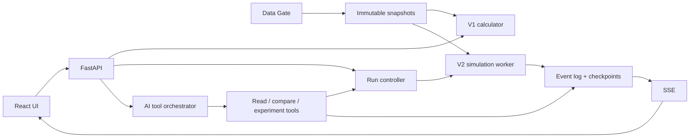

# Архитектура и контракты

## 1. Три слоя и границы ответственности

| Слой | Ответственность | Не выполняет |
|---|---|---|
| Аким | Интерфейс, команды, исследование сценариев, AI-советник | Прямую запись значений Score и состояния города |
| Город | Валидация, переходы состояния, время, очереди, расчёты | Подмену физических процессов текстом LLM |
| Данные | Источники, нормализация, качество, снимки, параметры | Автоматическое объявление корреляции причинностью |



## 2. Предлагаемый стек

- UI: React + TypeScript; карта через отдельный адаптер, графики и таблицы.
- API и расчёты: Python + FastAPI; общие схемы через типизированные модели/OpenAPI.
- Движок: собственный небольшой планировщик дискретных событий, массивы для массовых
  расчётов; внешние ABM-библиотеки оцениваются отдельным прототипом, не обязательны.
- Хранение: PostgreSQL; PostGIS при появлении реальной геометрии. Локальный demo-профиль
  может использовать файловые fixtures для входов, но контракт снимка общий.
- Сырые файлы и checkpoints: объектное хранилище; для разработки локальный каталог.
- Worker: отдельный процесс с заданиями в БД на первом этапе; очередь сообщений только
  после замера необходимости. Не начинать с микросервисов, Kubernetes или графовой БД.
- Контейнерный локальный запуск, фиксированные зависимости, CI для проверок.

Это проектный выбор, не утверждение о наличии этих компонентов в репозитории.

## 3. Планируемая структура

```text
apps/web/                  интерфейс акима
services/api/              API, доступ, orchestration
packages/contracts/        JSON Schema, OpenAPI, fixtures
engine/v1/                 validate, effects, score, search
engine/v2/                 scheduler, state, modules, checkpoints
ai/                        tools, policies, prompts, evidence validation
data-gate/                 adapters, quality, normalization, manifests
experiments/               protocols, configs, evaluation reports
data/                      неизменяемый исходник и синтетические примеры
tests/                     golden, properties, integration, replay, performance
docs/                      спецификации, ADR и руководство запуска
```

## 4. Основные сущности

```typescript
type Selection = { measureId: string; districtId: string | null };
type Scenario = {
  id: string; mode: "official-v1" | "dynamic-v2";
  parentId: string | null; dataSnapshotId: string;
  modelVersion: string; rulesVersion: string; parameterSetId: string;
  selections: Selection[];
};
type RunManifest = {
  runId: string; scenarioId: string; codeRevision: string;
  dataHash: string; parameterHash: string; seed: number;
  rngVersion: string; runtimeVersion: string;
  startSimTime: string; endSimTime: string; llmPolicyVersion: string;
};
type CityEvent = {
  id: string; runId: string; seq: number;
  simTime: string; recordedAt: string;
  type: string; actorId: string | null; districtId: string | null;
  causedBy: string[]; payloadSchemaVersion: string; payload: unknown;
};
type Evidence = {
  id: string; runId: string; metric: string; unit: string;
  window: [string, string]; value: number | null;
  status: "observed" | "simulated" | "assumed" | "derived";
  sourceIds: string[];
};
```

V1-result содержит valid, issues, cost, remainingBudget, score, districtScores,
indicators, average, minimum, criticalCount и decomposition. Невалидный официальный
набор возвращает `score: null`. Preview неполного набора явно отделён от итогового API.

## 5. API

| Метод | Назначение |
|---|---|
| GET /catalog | Версии и каталог V1 |
| POST /v1/validate | Проверка набора без LLM |
| POST /v1/evaluate | Точный расчёт допустимого набора |
| POST /v1/alternatives | Поиск при фиксированных ограничениях |
| POST /datasets/imports | Создать импорт Data Gate |
| GET /datasets/imports/{id}/report | Ошибки, mapping, preview |
| POST /datasets/imports/{id}/publish | Опубликовать проверенный снимок |
| POST /scenarios | Создать неизменяемую конфигурацию |
| POST /runs | Начать эксперимент, вернуть ID |
| POST /runs/{id}/commands | Пауза, шаг, скорость, управленческая команда |
| POST /runs/{id}/branches | Ветка из checkpoint |
| GET /runs/{id}/events | SSE с восстановлением по sequence |
| GET /runs/{id}/metrics | Временные ряды и evidence |
| POST /experiments | Ансамбль прогонов и сравнение |
| POST /assistant/messages | Вопрос и ответы с evidence IDs |
| GET /runs/{id}/export | Manifest, данные результата, журнал |

Долгие операции асинхронны. POST на запуск/команду принимает idempotency key.
Повтор команды не списывает бюджет снова. Ошибки содержат code, field, message.
Команды проверяют expectedStateVersion; конфликт обновления не затирает чужое решение.

## 6. Состояние и воспроизводимость

Снимок данных immutable. Сценарий immutable; изменение создаёт новую версию/ветку.
Состояние прогона меняется только через обработчик событий. Checkpoint содержит
очередь будущих событий, состояния RNG, балансы, очереди служб и состояния агентов.
Параллельные модули читают согласованный снимок и фиксируют изменения через барьер.

Гарантия replay: в зафиксированном окружении переходы состояния воспроизводимы по
журналу и checkpoint. Побитовая одинаковость на произвольном оборудовании не обещается.
LLM-тексты сохраняются для replay; физическая динамика первого релиза не зависит от них.

## 7. Эксплуатация

Логи связаны runId/commandId; измеряются длительность тика, backlog, память, ошибки,
стоимость LLM и время ответа UI. Worker поддерживает отмену и восстановление из
checkpoint. Медленный клиент получает агрегаты без потери авторитетного журнала.

Разделение доступа: просмотр, управление сценарием, импорт и публикация данных.
Внешние URL импортируются только разрешёнными адаптерами; лимиты размера, таймауты,
проверка формата и отсутствие выполнения содержимого файлов. Секреты исключены из
manifest и экспорта. Для публичного MVP — только синтетические/разрешённые открытые данные.
