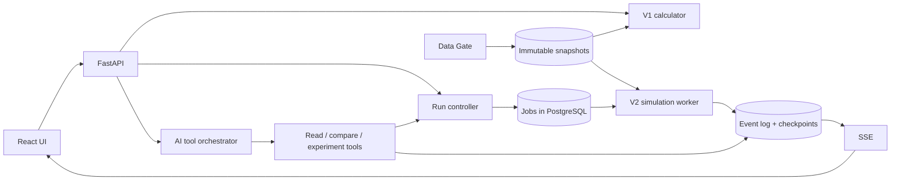

# Техническое задание V2 — «Живой город»

> **Статус документа:** ТЗ на реализацию, версия 1.0 от 23.09.2026.
> **Основание:** [01-product](01-product.md), [02-architecture](02-architecture.md),
> [04-v2-simulation](04-v2-simulation.md), [05-data-gate](05-data-gate.md),
> [06-ai-and-interactions](06-ai-and-interactions.md), [07-research-validation](07-research-validation.md),
> [08-delivery-plan](08-delivery-plan.md) и внутренний ресёрч команды по треку 12 (совет жителей).
> Этот документ не вводит новых механизмов сверх перечисленных документов. Он превращает их
> в требования с идентификаторами, контрактами и критериями приёмки. Места, где ТЗ уточняет
> то, что в docs оставлено открытым, помечены **[уточнение ТЗ]**.

---

## 0. Как читать

| Метка | Смысл |
|---|---|
| `REQ-xxx` | Требование. Каждое имеет критерий приёмки |
| **MUST** | Без этого V2 не считается реализованным |
| **SHOULD** | Входит в полный V2, допускает перенос на следующий этап |
| **MAY** | Расширение, делается только после измеренной пользы |
| P3…P8 | Этап из [08-delivery-plan](08-delivery-plan.md) §2 |

Все формулы ниже — **исследовательская модель, а не установленная причинная истина**
([04](04-v2-simulation.md) §1). Каждый коэффициент версионируется, имеет единицы, источник или
пометку «допущение» и диапазон для анализа чувствительности.

---

## 1. Что уже есть и от чего V2 отталкивается

| Компонент | Состояние в `main` | Роль в V2 |
|---|---|---|
| `engine/v1` | Реализован: валидатор, расчёт Score, декомпозиция, golden 52.55768 / 56.54307 | Остаётся неизменным. V2 **никогда** не меняет официальный Score V1 |
| `data_gate` | Реализован MVP: паспорт, качество, импорт source-text/JSON/GeoJSON, immutable-снимки, preview, rollback, файловое хранилище | Становится единственным входом данных V2. Нужны новые схемы и адаптеры (§11) |
| `packages/contracts` | JSON Schema для V1 и Data Gate | Добавляются схемы V2: Scenario, Run, Command, Event, Metric, Evidence, Checkpoint |
| HTTP API | Нет | Строится по §13; V1-эндпоинты — первыми |
| AI | Нет | Строится по §12; сначала для V1, затем инструменты V2 |
| Фронтенд | Ветка `codex/aygerim-frontend`: React + MapLibre, моки | План — в [10-frontend-plan](10-frontend-plan.md) |

**REQ-000 (MUST).** V1 и V2 разделены по `mode`, версиям данных, правил и метрик
([README](../README.md), [04](04-v2-simulation.md) §11). Ни один модуль V2 не импортирует
`engine/v1/domain/scoring.py` для расчёта своих метрик. Адаптер V2 → шкалы T1…C2 допускается
только как отдельная версия и называется **модельным индексом**, не официальным Score.
*Приёмка:* тест, который прогоняет V2 и проверяет, что `engine/v1` на том же снимке V1 даёт
прежние 52.55768 и 56.54307.

---

## 2. Цель, границы и чего V2 не обещает

### 2.1 Цель

Дать управленцу среду, где решения разворачиваются **во времени**: жители едут, службы работают
с очередями, погода меняет мощности, бюджет расходуется проводками, обращения возникают из
реального опыта агентов. Пользователь видит не средний балл, а распределение выгод, расходов,
времени ожидания и рисков между районами и группами ([01](01-product.md) §1).

На стратегическом горизонте (годы) V2 моделирует, как город **растёт и меняется**: динамику
населения и миграции (§9.11), застройку территории (§9.12), приток и отток денег (§9.13) и
институциональную реакцию на решения — голосования, слушания, поддержку групп (§9.14).

### 2.2 Границы

- V2 — **гибридная модель**: агентное поведение людей + дискретные события служб и
  инфраструктуры + агрегированные процессы экономики и среды ([01](01-product.md) §1).
- Чат персонажей сам по себе **не является** агентной симуляцией ([01](01-product.md) §1).
- Денежный баланс V2 — в заданной валюте и базовом периоде. **Нельзя** приравнивать условную
  единицу V1 к тенге ([01](01-product.md) §5).
- Число действий акима в V2 задаётся протоколом эксперимента, а не правилом «ровно 5».
- Административные границы версионируются; новый район требует нового снимка ([01](01-product.md) §5).

### 2.3 Отложенные обещания (не входят в V2)

Точный прогноз поведения каждого человека; подключение любого источника без адаптера;
достоверность на реальном городе без калибровки; модель национальной экономики
(экономика страны экзогенна); точный AQI из числа деревьев ([01](01-product.md) §7, [04](04-v2-simulation.md) §5).

### 2.4 Уровни зрелости данных ([05](05-data-gate.md) §7)

| Уровень | Данные | Что можно утверждать |
|---|---|---|
| **V2-demo** — цель этого ТЗ | Синтетические совместимые население, сеть, объекты, погода, ресурсы | «Лаборатория условных сценариев» |
| V2-calibrated | Реальные агрегаты с историей и независимым тестом | Ошибка на holdout для конкретной метрики |
| V2-live | Мониторинг свежести, запаздывающие события, reconciliation | Только после V2-calibrated |

---

## 3. Пользователи, роли и права

| Роль | Задачи ([01](01-product.md) §2) | Права ([02](02-architecture.md) §7) |
|---|---|---|
| Аким | Выбирает политику, распределяет ресурсы, реагирует на события | `run:control`, `scenario:write` |
| Аналитик | Меняет допущения, запускает ансамбли, проверяет устойчивость | `run:control`, `experiment:write`, `parameters:write` |
| Исследователь | Калибрует механизмы, публикует эксперименты | всё аналитика + `dataset:import` |
| Хранитель данных **[уточнение ТЗ]** | Импорт и публикация снимков | `dataset:import`, `dataset:publish` |
| Жюри / наблюдатель | Проверяет условия, правила, запуск | `read` |

**REQ-001 (SHOULD, P3).** Разделение доступа минимум на четыре права: просмотр, управление
сценарием, импорт данных, публикация данных. Для локального demo-профиля допустим один
пользователь со всеми правами, но проверки прав в сервисах присутствуют.

---

## 4. Пользовательские сценарии V2

Основа — [01](01-product.md) §3 «V2 — живой город». Для каждого сценария — критерий приёмки.

| ID | Сценарий | Критерий приёмки |
|---|---|---|
| **UC-1** | Выбрать территорию, население, экономический и погодный сценарий | Создан immutable `Scenario` со ссылками на опубликованные снимки Data Gate, `parameterSetId`, `modelVersion` |
| **UC-2** | Увидеть покрытие данных и неподтверждённые допущения | Экран/ответ API перечисляет для каждого модуля: источник (`observed/estimated/synthetic`), допущения, пропуски |
| **UC-3** | Запустить часы: пауза, шаг, скорость, горизонт | Команды подтверждаются < 1 с; `step` продвигает ровно на заданное модельное время |
| **UC-4** | Наблюдать поездки, загрузку объектов, события, обращения, бюджет | Агрегаты приходят 1–2 раза/с по SSE; журнал событий восстанавливается по `seq` после разрыва |
| **UC-5** | Внести решение с датой начала, ресурсами и сроком | Команда проходит валидацию и ledger-резервирование; повтор с тем же idempotency key не списывает бюджет повторно |
| **UC-6** | Создать ветку из текущего checkpoint и сравнить | Две ветки с одним прошлым и парными RNG-потоками; без вмешательства ветки совпадают по контрольному состоянию |
| **UC-7** | Запустить серию прогонов с разными seed | Отчёт с медианой, интервалами и долей нарушений ограничений, а не одним графиком |
| **UC-8** | Открыть причинную трассу | От метрики можно пройти к событиям-причинам через `causedBy` и изменения состояния |
| **UC-9** | Посмотреть, как меняется население | Пирамида и численность по районам во времени; миграционное сальдо по группам с причинами (факторы привлекательности) |
| **UC-10** | Управлять застройкой | Команды зонирования, выделения участков, моратория; видно, как ввод жилья опережает или отстаёт от инфраструктуры |
| **UC-11** | Разобрать деньги города | Sankey притока и оттока за период; баланс сходится; видна стоимость владения проекта на горизонте |
| **UC-12** | Провести решение через институты | Бюджет и зонирование проходят голосование, крупные проекты — слушания; видно, кто за/против и почему, и как это сдвигает сроки |

---

## 5. Эталонный вертикальный срез: «Снегопад»

Единственный сценарий, который V2 обязан пройти от начала до конца первым
([README](../README.md), [08](08-delivery-plan.md) §7). Все модули P4 проверяются на нём.

### 5.1 Сюжет

```text
Город работает в штатном режиме (warmup)
  → погодный модуль: снегопад, интенсивность I, окно [t0, t1]
  → транспорт: пропускная способность рёбер снижается → растут время поездки и ожидание
  → службы: растёт очередь заданий уборки/ремонта, бригады перегружены
  → жители: фактический опыт задержек → вероятность обращения
  → обращения: поступление → классификация → назначение
  → аким: перераспределяет одну бригаду (команда с ресурсами и сроком)
  → ветка «без вмешательства» vs ветка «с решением» из одного checkpoint
  → сравнение по заранее заданным метрикам, серия seed, интервалы
```

### 5.2 Протокол эксперимента ([07](07-research-validation.md) §8)

```yaml
experiment_id: snow-response-v1
question: Снижает ли перераспределение одной бригады часы недоступности услуг при том же бюджете?
baseline: no-reallocation
intervention: reallocate-one-crew
primary_outcome: service-unavailability-hours
secondary_outcomes: [travel-time-p90, backlog, expenditure]
constraints: [same-initial-state, same-weather, budget-feasible]
data_snapshot: <immutable snapshot id>
model_version: <git revision>
parameter_set: <version>
seeds: <список, зафиксированный до запуска>
warmup: <длительность>
horizon: <длительность>
analysis: paired-difference-with-interval
stopping_rule: predefined-compute-budget-and-precision
```

### 5.3 Приёмка среза (MUST, P4)

1. Цепочка снег → мощность → задержка → очередь → обращение видна в журнале событий через `causedBy`.
2. Каждое обращение ссылается на опыт/инцидент агента, а не порождено текстом.
3. Две ветки из одного checkpoint **без вмешательства** дают одинаковое контрольное состояние.
4. Парная разница по `service-unavailability-hours` показана с интервалом по серии seed.
5. Статус неполных подсистем виден в UI; синтетическая природа и режим времени обозначены.

### 5.4 Второй эталонный срез: «Десять лет роста» — P5/P6

Стратегический сценарий для модулей §9.11–9.14 (снегопад проверяет оперативный масштаб, этот —
стратегический).

```text
Сценарий внешнего притока населения (экзогенный, с диапазоном)
  → демография: рост и омоложение Нуры за счёт миграции семей
  → застройка: девелоперы стартуют жильё там, где разрешено и выгодно
  → ввод жилья опережает школы и сети → очереди в школах, пробки, аварии
  → финансовые потоки: налоговая база растёт медленнее OPEX → давление на бюджет
  → политика: значимость темы «школы» растёт, поддержка семей в районе падает
  → аким: ветка A — мораторий на застройку; ветка B — опережающие школы с займом;
           ветка C — требования к девелоперу строить соцобъекты
  → маслихат голосует по бюджету веток B и C
  → сравнение трёх веток на 10 лет по серии seed
```

Приёмка (MUST для P6):

1. Баланс населения (REQ-048) и денег (REQ-054) сходится на всём горизонте.
2. Мораторий снижает ввод жилья, но **повышает цену** и меняет миграцию — эффект виден через
   механизмы §9.11–9.12, а не задан вручную.
3. Голосование по бюджету может провалиться; тогда видна задержка ветки и её причина.
4. Результат — распределение по seed и параметрам с интервалами; «лучшая ветка» показывается
   вместе с Pareto-компромиссом (качество услуг / цена жилья / долг / поддержка).

---

## 6. Архитектура

### 6.1 Компоненты ([02](02-architecture.md) §1–2)



| Слой | Отвечает за | Не делает |
|---|---|---|
| Аким (UI + API) | Команды, исследование сценариев, AI-советник | Прямую запись Score или состояния города |
| Город (worker) | Валидация команд, переходы состояния, время, очереди, расчёты | Подмену физических процессов текстом LLM |
| Данные (Data Gate) | Источники, нормализация, качество, снимки, параметры | Объявление корреляции причинностью |

### 6.2 Стек ([02](02-architecture.md) §2)

- Python + FastAPI для API и расчётов; типизированные модели и OpenAPI.
- Собственный небольшой планировщик дискретных событий; массивы (NumPy) для массовых расчётов.
  Внешние ABM-библиотеки — только после отдельного прототипа и ADR.
- PostgreSQL; PostGIS — при появлении реальной геометрии. Локальный demo-профиль — файловые
  fixtures с тем же контрактом снимка (так уже устроен `data_gate`).
- Checkpoints и сырые файлы — объектное хранилище; локально — каталог.
- Worker — отдельный процесс с заданиями в БД. Очередь сообщений — только после замера.
- **Запрещено на старте:** микросервисы, Kubernetes, графовая БД.

### 6.3 Структура каталогов ([02](02-architecture.md) §3)

```text
apps/web/            интерфейс
services/api/        FastAPI: роутеры, доступ, orchestration
packages/contracts/  JSON Schema, OpenAPI, fixtures
engine/v1/           (есть) validate, effects, score
engine/v2/
  domain/            состояние, события, модули-подсистемы (чистые функции переходов)
  application/       run controller, scheduler, checkpoint, branching, replay
  infrastructure/    хранилище событий и checkpoint, RNG, загрузка снимков
ai/                  tools, policies, prompts, evidence validation
data_gate/           (есть) адаптеры, качество, снимки
experiments/         протоколы, конфиги, отчёты
tests/               golden, properties, integration, replay, performance
```

Clean architecture как в `engine/v1` и `data_gate`: домен без I/O, прикладной слой с портами,
инфраструктура реализует порты, сборка зависимостей в одном месте.

---

## 7. Движок времени и событий (P3)

### 7.1 Модель состояния ([04](04-v2-simulation.md) §1)

```text
X(t + Δt) = Fθ(X(t), A(t), Z(t), ε(t))     переход состояния
Y(t)      = G(X(t))                          рассчитанные метрики
O(t)      = H(X(t), reporting_process, noise) наблюдения (обращения, датчики, опросы)
```

- `X` — население, инфраструктура, мощности, сети, транспорт, очереди, финансы, проекты.
- `A` — решения акима, `Z` — внешние условия, `θ` — версионированные параметры, `ε` — управляемый RNG.
- **REQ-010 (MUST).** `Y` и `O` хранятся раздельно. Метрика «число обращений» — это `O`, а не `Y`:
  рост обращений может означать удобный канал, а не ухудшение услуг.

### 7.2 Три масштаба времени ([04](04-v2-simulation.md) §2)

| Масштаб | Процессы | Начальный шаг |
|---|---|---|
| Оперативный | Поездки, происшествия, диспетчеризация | События с точным временем; агрегация 5–15 мин |
| Суточный | Расписания, отходы, обслуживание, потребности | День |
| Стратегический | Финансы, стройка, миграция, износ, сезонность | Месяц (при необходимости квартал) |

**REQ-011 (MUST).** Глобальные часы задают порядок. При одинаковом времени — фиксированный
приоритет типа события, затем стабильный ID. Месячный расход проводится один раз, а не на
каждом транспортном тике. Модуль публикует поток или запас с явным временным окном.

### 7.3 Цикл шага ([04](04-v2-simulation.md) §2)

```text
1. принять команды         5. переходы состояния
2. внешние события         6. проводки и обращения
3. спрос агентов           7. агрегаты
4. распределение ресурсов  8. checkpoint / публикация
```

**REQ-012 (MUST).** Межмодульные эффекты используют оговорённый порядок или следующий шаг,
без скрытых циклических обновлений. Параллельные модули читают согласованный снимок и
фиксируют изменения через барьер ([02](02-architecture.md) §6).

### 7.4 Случайность ([07](07-research-validation.md) §6)

**REQ-013 (MUST).** RNG-потоки keyed по `(run family, module, agent/event, time)`. Добавление
события в одной ветке **не сдвигает** случайные числа другой ветки. Версия генератора — в
manifest (`rngVersion`). *Приёмка:* property-тест — вставка события в ветку B не меняет
последовательность случайных чисел ветки A для других агентов.

### 7.5 Жизненный цикл прогона **[уточнение ТЗ]**

```text
created → running ⇄ paused → completed
            ↓         ↓
          failed   cancelled
```

- `running → paused` подтверждается < 1 с между ограниченными пакетами событий ([08](08-delivery-plan.md) §5).
- `failed` сохраняет последний checkpoint; worker восстанавливается с него.
- Отмена — кооперативная, между пакетами.

### 7.6 Команды

**REQ-014 (MUST).** Команда содержит `commandId`, `idempotencyKey`, `expectedStateVersion`,
`type`, `payload`, `issuedBy`. Повтор с тем же ключом возвращает прежний результат и не
списывает бюджет второй раз. Конфликт `expectedStateVersion` отклоняется с кодом
`state_version_conflict`, чужое решение не затирается ([02](02-architecture.md) §5).

Типы команд V2 **[уточнение ТЗ]**, каждый проходит валидацию и ledger-резервирование (§9.9):

| Тип | Пример | Проверки |
|---|---|---|
| `clock.pause / resume / step / speed` | шаг на 1 час модельного времени | состояние прогона |
| `crew.reassign` | бригада → район/тип заданий с даты | навыки, смена, доступность |
| `project.start` | стройка школы: CAPEX, этапы, штат | бюджет, `available_to_commit`, ресурсы |
| `funding.change` | изменение OPEX службы | резерв, обязательства |
| `service.policy` | приоритет очереди, график | допустимые значения |
| `transport.service` | интервал маршрута, выделенная полоса | ресурсы подвижного состава |
| `zoning.change` | изменить зону и предельную плотность участков | слушания, голосование (§9.14) |
| `land.allocate` | выделить участок под школу или жильё | свободные участки, зонирование |
| `development.moratorium` | мораторий на новые старты в районе | срок, основание |
| `developer.requirement` | обязать строить соцобъекты при вводе жилья | применимость к новым проектам |
| `budget.submit` / `budget.amend` | годовой бюджет и его уточнение | баланс, голосование маслихата |
| `promise.announce` | публичное обещание с метрикой и сроком | метрика существует, срок в горизонте |
| `hearing.schedule` | общественные слушания по проекту | обязательность по типу решения |

### 7.7 Checkpoint, ветки, replay ([02](02-architecture.md) §6)

- **REQ-015 (MUST).** Checkpoint содержит очередь будущих событий, состояния RNG, балансы,
  очереди служб и состояния агентов. Восстановление из checkpoint + журнал = то же состояние.
- **REQ-016 (MUST).** Ветка создаётся из checkpoint; прошлое общее, будущее раздельное.
  Память NPC ветки не утекает в другую ([06](06-ai-and-interactions.md) §5).
- **REQ-017 (MUST).** Replay: в зафиксированном окружении переходы воспроизводимы по журналу и
  checkpoint. Побитовое совпадение на произвольном оборудовании **не обещается**.
- LLM-тексты сохраняются для replay; физическая динамика первого релиза от них не зависит.

---

## 8. Сущности и контракты данных

Базовые типы — из [02](02-architecture.md) §4, расширения помечены **[уточнение ТЗ]**.
Для каждой сущности — JSON Schema в `packages/contracts/v2-*.schema.json`.

```typescript
type Scenario = {
  id: string; mode: "official-v1" | "dynamic-v2";
  parentId: string | null; dataSnapshotId: string;
  modelVersion: string; rulesVersion: string; parameterSetId: string;
  selections: Selection[];                       // для V1
  commands?: ScheduledCommand[];                  // для V2 [уточнение ТЗ]
  weatherScenarioId?: string; economyScenarioId?: string;
};

type RunManifest = {
  runId: string; scenarioId: string; codeRevision: string;
  dataHash: string; parameterHash: string; seed: number;
  rngVersion: string; runtimeVersion: string;
  startSimTime: string; endSimTime: string; llmPolicyVersion: string;
  branchOf?: { runId: string; checkpointId: string };  // [уточнение ТЗ]
};

type CityEvent = {
  id: string; runId: string; seq: number;
  simTime: string; recordedAt: string;
  type: string; actorId: string | null; districtId: string | null;
  causedBy: string[]; payloadSchemaVersion: string; payload: unknown;
};

type Evidence = {
  id: string; runId: string; metric: string; unit: string;
  window: [string, string]; value: number | null;
  status: "observed" | "simulated" | "assumed" | "derived";
  sourceIds: string[];
};
```

Дополнительные сущности **[уточнение ТЗ]**, поля — из [04](04-v2-simulation.md) §3:

| Сущность | Ключевые поля |
|---|---|
| `Household` / `Resident` | id, район/дом, возрастная группа, состав семьи, занятость, доход, обязательные расходы, доступ к транспорту, место работы/учёбы, расписание, потребности, мобильность, приоритеты, склонность обращаться, **weight** |
| `Facility` (школа, поликлиника) | местоположение, мощность, штат, график, бюджет, очередь |
| `RoadEdge` / `Route` | длина, пропускная способность, время проезда, расписание, загрузка |
| `UtilityAsset` | состояние, ресурс, вероятность отказа, обслуживание |
| `GreenArea` / `Tree` | вид/класс, возраст, площадь, состояние, потребность в воде |
| `Crew` | навыки, смена, транспорт, доступность, территория, задания, материалы |
| `Project` | этапы, CAPEX, будущий OPEX, ресурсы, прогресс, ввод, срок службы |
| `LedgerEntry` | время, счёт, сумма, валюта, тип (`revenue/transfer/capex/opex/reserve/release`), ссылка на команду/проект |
| `Appeal` (обращение) | source/channel ID, внешний ID, время события и получения, территория, тема, статус, основание обработки, confidence классификации, ссылка на опыт агента ([05](05-data-gate.md) §4) |
| `Cohort` | район, возрастная группа, пол, численность, веса агентов-представителей |
| `MigrationFlow` | период, откуда, куда (район или «вне города»), группа, объём, факторы-причины |
| `Parcel` | геометрия, зона, предельная плотность, владелец, статус |
| `DevelopmentProject` | участок, тип, площадь, этап, даты, стоимость, девелопер, требования |
| `HousingStock` | район, класс, единицы, свободные, цена, аварийность |
| `Account` / `Transfer` | сектор (город / домохозяйства / бизнес), счёт, период, сумма, основание |
| `StakeholderGroup` | район, признаки группы, интересы (веса по исходам), поддержка, мобилизация |
| `Deputy` (синтетический) | округ-район, приоритеты, история голосований |
| `Vote` / `Hearing` | предмет, дата, участники, исход, объяснение по факторам |
| `Promise` | формулировка, метрика, целевое значение, срок, статус выполнения |
| `IssueSalience` | тема, значимость во времени, источники (события, обращения) |
| `Checkpoint` | id, runId, simTime, stateVersion, хэш, ссылка на объект в хранилище |
| `MetricSeries` | metricId, unit, window, aggregation, groupBy, points, evidenceIds |

**REQ-020 (MUST).** Каждое числовое поле имеет единицу. Неизвестное значение — `null`, не 0
([01](01-product.md) §4, [05](05-data-gate.md) §5).

---

## 9. Подсистемы города

Для каждого модуля обязательны ([04](04-v2-simulation.md) §11): **input/output contract,
единицы, период обновления, владелец состояния, список потребителей, тесты**. Модуль без
реализованной динамики помечается `status: not-implemented` и **не имитируется** выдуманной
лентой ([04](04-v2-simulation.md) §12).

### 9.1 Синтетическое население — P4, MUST

- Генерация по агрегированным распределениям; реальные персональные профили не нужны.
- **REQ-030.** Сохранять заданные маргинальные распределения; совместные зависимости проверять
  отдельно. Средняя зарплата не задаёт распределение доходов.
- **REQ-031.** Weighted agents/когорты: вес учитывается в спросе и агрегатах. Для очередей и
  редких событий агент с весом 100 **не превращается** в неделимого человека — делить потоки
  или использовать агрегированную модель.
- У агента собственные наблюдения, ограниченная информация и память событий; все параметры
  симуляции он не знает.
- *Тесты:* маргиналы в допуске; сумма весов = население; результаты на двух уровнях
  детализации сравнены, смещение измерено.
- *Цель прототипа:* 1 000–10 000 агентов на одном worker — цель для измерения, не обещание.

### 9.2 Транспорт — P4, MUST

- Спрос: поездки дом–работа, дом–школа, услуги, досуг.
- Выбор маршрута ([04](04-v2-simulation.md) §4):

```text
cost(route, agent) = fare + value_of_time × travel_time + accessibility_penalty
P(route = j)       = softmax(−β × cost_j)   по допустимым маршрутам
```

- `value_of_time` — деньги/время; `β` согласован с единицами стоимости. Время ребра —
  возрастающая функция загрузки v/c (формула и коэффициенты версионируются).
- Ограничения: вместимость автобусов, интервалы, пересадки, погода, перекрытия.
- **Выходы:** время поездки P50/P90, ожидание, доля неудовлетворённого спроса, доступность,
  загрузка, операционные расходы.
- **Тесты:** нулевой спрос; закрытое ребро; нехватка мест; сохранение числа поездок;
  недоступный маршрут без «телепортации» агента.

### 9.3 Погода и внешние условия — P4, MUST

- Экзогенный сценарий временных рядов (интенсивность, температура, окно).
- **REQ-040.** Погода снижает **конкретные мощности** (пропускная способность рёбер,
  производительность бригад), а не добавляет отдельный штраф в utility — иначе двойной счёт
  ([04](04-v2-simulation.md) §11).

### 9.4 Городской сервис: ЖКХ, отходы, бригады — P4, MUST

- ЖКХ: износ → профилактика → погодная нагрузка → отказ → обнаружение → диспетчеризация →
  ремонт → возврат мощности.
- Отходы: образование → накопление → маршрут → вывоз (ограничения техники, смены, вместимости).
- **REQ-041.** При закрытии заявки проверяется **физическое состояние**: текст «решено» не
  устраняет аварию.
- **Выходы:** часы недоступности услуг, невыполненные заявки, P90 времени решения, доля в
  срок, загрузка бригад, стоимость обслуживания.

### 9.5 Обращения жителей — P4, MUST

Цикл ([06](06-ai-and-interactions.md) §2):

```text
1. опыт (задержка, нет места, авария, переполнение)
2. поведенческая модель: вероятность обращения и канал
3. структурированное обращение со ссылкой на опыт/инцидент
4. LLM при необходимости формулирует текст — без новых обстоятельств
5. классификация: тема, срочность, служба, confidence
6. детерминированные правила проверяют назначение и ресурсы
7. служба выполняет работу → меняется город и статус
8. житель наблюдает результат → подтверждает или открывает повторно
```

- Вероятность обращения зависит от тяжести, доступа к каналу, прошлого опыта, параметров.
- **REQ-042.** Отсутствие обращения не доказывает отсутствие проблемы. Число реплик NPC не
  используется как опрос населения.
- **REQ-043.** Повторные сообщения одного инцидента связываются; обращения разных жителей не
  теряются. Реальные и синтетические обращения хранятся в разных пространствах ([05](05-data-gate.md) §4).

### 9.6 Социальная инфраструктура — P5, SHOULD

```text
queue_next         = max(0, queue + arrivals − served)
served             ≤ available_capacity
available_capacity = min(building_capacity, staff_capacity, funded_capacity)
```

- Дети соответствующих возрастов формируют спрос на места; медпомощь — отдельный процесс.
- Отказы/перенаправления учитываются отдельно от очереди. Поликлиника не увеличивает число
  школьных мест: абстрактные связи V1 **не переносятся** в V2.
- **Тесты:** насыщение мощности; ввод здания без персонала; приоритеты очереди; сохранение
  количества запросов.

### 9.7 Озеленение и среда — P5, SHOULD

- Запасы: площадь зелени/кроны, живые посадки, влажность. Потоки: посадка, рост, уход, гибель.
- Водный и финансовый бюджет ограничивают обслуживание; погода влияет на приживаемость.
- Доступность парка — расстояние/время по сети, не только м² на жителя.
- **REQ-044.** Без обоснованной модели не выдавать AQI из числа деревьев. Загрязнение —
  внешнее поле или простая модель источников с явными допущениями.
- **Тесты:** баланс посадок; неотрицательная площадь; ограничение воды; нет мгновенного роста
  взрослого дерева.

### 9.8 Безопасность — P5, SHOULD

```text
P(event за Δt) = 1 − exp(−λ·Δt)
```

- Экспозиция, вероятность и тяжесть моделируются раздельно.
- **REQ-045.** Коэффициенты освещения/камер не считаются доказанными без данных. Усиление
  выявления может **увеличить** зарегистрированные события — фактические и зарегистрированные
  разделены.
- Сравнивать ансамбли, а не один редкий исход.
- **Тесты:** λ = 0; изменение шага времени; отделение фактических от зарегистрированных;
  нет отрицательных рисков.

### 9.9 Финансы, ledger и проекты — P3 (ledger) / P5 (стратегия)

```text
cash(t+1)          = cash(t) + revenue + transfers + financing
                     − capex_paid − opex_paid − debt_service
available_to_commit = cash − reserved_obligations − required_reserve
```

- **REQ-046 (MUST, P3).** Обязательство, резервирование и оплата — разные состояния; деньги не
  списываются дважды. Финансирование/долг выключены по умолчанию.
- Проект требует CAPEX и последующего OPEX; нехватка штата/материалов задерживает ввод.
- Реальные доходы — в ценах базового периода. Инфляционный шок не применяется одновременно к
  номинальному ряду и к уже индексированной стоимости.
- Экономика страны — экзогенные ряды: инфляция, занятость, зарплаты, трансферты, курс.
- **Тесты:** баланс проводок сходится; двойное списание невозможно; идемпотентная команда не
  создаёт вторую проводку.

### 9.10 Удовлетворённость и модельный NPS — P5, MAY

```text
s_i(t+1) = clip((1−ρ)·s_i(t) + ρ·utility_i(experienced_outcomes), 0, 100)
NPS      = 100 × (доля 9–10 − доля 0–6)   среди ответивших
```

- Сначала считается **фактический опыт** агента; удовлетворённость — производная.
- Шкала — не измеренная общественная поддержка; NPS синтетических агентов называется
  «модельный NPS» и не подменяет опрос. Без обоснованного survey-модуля показывать
  удовлетворённость и распределение потребностей ([04](04-v2-simulation.md) §10).

### 9.11 Демография: рост, старение и миграция населения — P5, MUST

Население в V2 **меняется во времени**, а не только генерируется на старте (§9.1).
Базовая схема — когортно-компонентная модель **[уточнение ТЗ]**:

```text
P[d, a+1, t+1] = P[d, a, t] − deaths[d, a, t] + in_migr[d, a, t] − out_migr[d, a, t]
P[d, 0, t+1]   = births[d, t]
births[d, t]   = Σ_a fertility[a, t] × women[d, a, t]
deaths[d, a,t] = mortality[a, t] × P[d, a, t]
```

`d` — район, `a` — возрастная когорта, шаг — месяц или квартал (стратегический масштаб, §7.2).
Формула записана для шага, равного ширине когорты; при более коротком шаге в следующую когорту
переходит доля `Δt / ширина_когорты`, а коэффициенты рождаемости и смертности масштабируются на `Δt`.

**Миграция** — главный канал обратной связи между решениями и ростом города:

```text
attractiveness[d, g, t] = Σ_k w_k[g] × factor_k[d, t]
    factors: доступ к рабочим местам, стоимость жилья к доходу,
             доступность школ/поликлиник, время поездки, безопасность, среда
out_rate[d, g, t]       = base_out[g] × σ(−α_g × (attractiveness[d] − attractiveness_ref[g]))
in_flow[d, g, t]        = external_inflow[g, t] × share_logit(attractiveness[·, g, t])[d]
internal_moves          = logit-выбор района среди тех, где есть свободное жильё
```

- `g` — группа (возраст, доход, состав семьи). Веса `w_k[g]` у групп разные: семьи с детьми
  чувствительнее к школам, молодёжь — к работе и цене аренды.
- Внешний приток из других регионов и отток из города — экзогенные сценарии с диапазонами;
  город влияет только на **распределение** и **удержание**, а не на весь национальный поток.
- Инерция: переезд требует свободного жилья (§9.12) и происходит с задержкой, решения не
  переселяют людей мгновенно.
- Формирование и распад домохозяйств: молодые взрослые создают новые домохозяйства → спрос на
  жильё растёт быстрее численности населения.

**REQ-048 (MUST).** Баланс населения сходится на каждом шаге:
`P(t+1) = P(t) + births − deaths + in − out` по району и по городу, с точностью до весов агентов.

**REQ-049 (MUST).** Новые жители порождают спрос во **всех** подсистемах через их обычные
механизмы (поездки, места в школах, обращения, налоги), а не через отдельный «штраф за рост».

- **Выходы:** численность и половозрастная пирамида по районам, естественный прирост,
  миграционное сальдо по группам, число домохозяйств, иждивенческая нагрузка.
- **Тесты:** нулевая миграция и равные рождаемость/смертность → стационарность; сохранение
  людей при внутренних переездах; нет отрицательных когорт; переезд невозможен без жилья;
  сходимость при смене шага месяц/квартал.
- **Честность:** до калибровки это «сценарий роста», не демографический прогноз. Параметры
  рождаемости, смертности и миграции — из реальных агрегатов при наличии, иначе с пометкой
  «допущение» и диапазоном.

### 9.12 Застройка и развитие территории — P5, MUST

Город растёт физически: участки → разрешения → стройка → ввод → износ и снос.

**Запасы:** участки с зонированием и предельной плотностью; жилой фонд (квартиры по районам
и классам); коммерческие и социальные площади; инженерная ёмкость (тепло, вода, канализация,
электричество) по районам.

**Конвейер проекта застройки** **[уточнение ТЗ]**:

```text
идея → заявка → [слушания] → разрешение → стройка (N кварталов) → ввод → эксплуатация → износ
```

- **Решение девелопера** (агрегированный агент): начинать ли проект на участке.
  ```text
  expected_margin = expected_price × sellable_area − land_cost − build_cost − fees − financing_cost
  P(start)        = σ(γ × expected_margin / build_cost)   если участок и зонирование позволяют
  ```
- **Цена жилья** — простая модель запасов и потоков:
  ```text
  price[d, t+1] = price[d, t] × (1 + ε_p × (demand[d, t] − supply[d, t]) / supply[d, t])
  ```
  где спрос — от демографии (§9.11) и доходов, предложение — свободный фонд. `ε_p` —
  параметр с диапазоном; модель не выдаётся за рынок недвижимости.
- **Инфраструктурное ограничение:** ввод жилья, для которого нет инженерной ёмкости, школ или
  дорог, создаёт **дефицит** (очереди в школах §9.6, пробки §9.2, отказы сетей §9.4), а не
  блокируется молча. Это главный механизм «город строит жильё быстрее инфраструктуры».
- **Решения акима:** изменение зонирования и плотности, выделение участков, опережающее
  строительство инфраструктуры, требования к девелоперу (соцобъекты, дворы), мораторий
  в районе, снос аварийного фонда.

**REQ-052 (MUST).** Площади не появляются мгновенно: каждый объект проходит этапы со сроками;
незавершённая стройка не даёт жилья, но уже требует ресурсов.

**REQ-053 (MUST).** Суммарная площадь застройки участка не превышает предельную по
зонированию; изменение зонирования — версионируемая команда (§7.6), которая может требовать
слушаний (§9.14).

- **Выходы:** ввод жилья по районам, свободный фонд, цена и индекс доступности жилья
  (цена / доход), плотность, дефицит мест в школах и инженерной ёмкости на нового жителя,
  доля аварийного фонда. На карте — рост зданий во времени (3D-слой `territory-geojson`).
- **Тесты:** сохранение площади (ввод − снос = изменение фонда); нет стройки без участка;
  мораторий останавливает новые старты, но не текущие стройки; нулевой спрос → нет новых стартов.

### 9.13 Финансовые потоки города: приток и отток — P5, MUST

Расширяет ledger §9.9. Доходы и расходы города **зависят от состояния города**, а не задаются
константой **[уточнение ТЗ]**.

**Три сектора и счета** (денежная масса сохраняется между ними):

| Сектор | Приток | Отток |
|---|---|---|
| Бюджет города | Налоги с доходов (∝ занятые × зарплаты), на имущество (∝ стоимость фонда), с бизнеса (∝ выручка), сборы и продажа участков, трансферты из республиканского бюджета, заимствования (выкл. по умолчанию) | OPEX служб (∝ население и число активов), CAPEX проектов, субсидии, обслуживание долга, трансферты в районы |
| Домохозяйства | Зарплаты, пенсии и пособия, продажа жилья | Налоги, жильё (аренда/ипотека), транспорт, услуги, потребление |
| Бизнес и девелоперы (агрегат) | Выручка от потребления, продажа жилья, частные инвестиции извне | Зарплаты, налоги, стройка, вывод прибыли |

```text
revenue[t]  = Σ_d tax_base[d, t] × rate + fees[t] + land_sales[t] + transfers[t]
opex[t]     = Σ_service unit_cost × volume[service, t] × price_index[t]
investment_inflow[t] = f(attractiveness_business, expected_return)   экзогенный сценарий + отклик
```

- **Бюджетный цикл:** годовой план → согласование (§9.14) → квартальное исполнение →
  уточнение бюджета в течение года. Неисполненные обязательства переносятся явно.
- **Обратные связи, ради которых модуль нужен:** рост населения → больше налогов **и** больше
  OPEX; застройка → доход от участков сейчас и расходы на содержание инфраструктуры потом;
  отток жителей → падение базы при тех же обязательствах.
- **REQ-054 (MUST).** Сохранение денег: сумма изменений всех счетов равна сумме внешних
  притоков минус внешних оттоков за период. Тест на каждом шаге.
- **REQ-055 (MUST).** Номинальные и реальные величины разделены; инфляция (§9.9) применяется
  к ценам ровно один раз.
- **Выходы:** диаграмма потоков (Sankey) за период, баланс, дефицит/профицит, структура
  доходов и расходов, доля трансфертов, долг, налоговая база на жителя, OPEX на жителя,
  «стоимость владения» каждого проекта на горизонте.
- **Тесты:** сохранение денег; нулевое население → нулевая налоговая база; проект без OPEX
  не проходит валидацию; перенос обязательств между годами без потери и без дубля.

### 9.14 Политические процессы и легитимность решений — P6, SHOULD

Решения акима проходят через институты и реакцию групп интересов. Модуль моделирует
**процессы управления**, а не реальную политику.

**Акторы (синтетические):**

- **Группы интересов**: жители по районам и группам (§9.11), бизнес, девелоперы,
  профессиональные сообщества служб. У каждой — интересы как функция фактических исходов.
- **Представительный орган** (маслихат) **[уточнение ТЗ]**: синтетические депутаты с
  округами-районами; голосуют по бюджету, зонированию и крупным проектам.
- **Медиа-повестка**: значимость тем (транспорт, жильё, сервисы…) растёт от событий и
  обращений и затухает.

**Механизмы:**

```text
support[g, t+1]   = clip((1−ρ)·support[g, t] + ρ·utility_g(experienced_outcomes, promises_kept), 0, 1)
salience[k, t+1]  = decay × salience[k, t] + Σ events[k, t] × impact + appeals[k, t] × weight
P(vote_yes[j])    = σ(β₀ + β₁·benefit_to_district[j] + β₂·support[district(j)] + β₃·political_capital)
political_capital[t+1] = political_capital[t] + delivered_visible_outcomes − broken_commitments
                         − crisis_penalty × unresolved_crises − conflict_cost
```

- **Институциональные ворота:** годовой бюджет и изменения зонирования требуют голосования;
  крупные проекты и смена зонирования — общественных слушаний (задержка, стоимость, возможное
  изменение проекта). Провал голосования — событие с последствиями (задержка, пересмотр).
- **Мобилизация:** при низкой поддержке и высокой значимости темы растут обращения (§9.5),
  явка на слушания, вероятность публичного протеста как **события** с вероятностью
  `1 − exp(−λ(support, salience)·Δt)`; протест задерживает проекты, не меняет физику города.
- **Обещания:** публичные обещания акима — объекты со сроком и метрикой; выполнение и
  невыполнение проверяются по фактическому состоянию, а не по тексту.
- **Связь с AI:** совет жителей (§12.4) и NPC-депутаты озвучивают позиции групп на
  слушаниях и перед голосованием; **исход голосования считает модель**, не LLM.

**REQ-056 (MUST).** Политические переменные влияют на город только через явные механизмы:
задержки и изменения решений, обращения, голосования. Поддержка не прибавляется к метрикам
качества жизни и не подменяет их.

**REQ-057 (MUST, этика).** Только синтетические акторы: никаких реальных политиков, партий,
депутатов или избирателей. Модуль не прогнозирует выборы, не строит профили реальных людей,
не генерирует агитацию, сообщения для убеждения или таргетинг групп. Все выходы помечены
как гипотезы модели. Параметры поддержки и голосования — допущения с диапазонами
до калибровки на открытых агрегированных данных.

- **Выходы:** поддержка по группам и районам, политический капитал, повестка (топ тем),
  календарь голосований и слушаний, исходы голосований с расчётом «кто за/против и почему»,
  задержки проектов по политическим причинам.
- **Тесты:** при нулевой значимости тем нет протестов; голосование детерминировано при
  фиксированном seed; провал бюджета включает режим временного финансирования, а не
  останавливает город; ветки не делят политическое состояние после checkpoint.


### 9.15 Матрица связей и защита от двойного счёта ([04](04-v2-simulation.md) §11)

| Модуль → | Публикует | Потребители |
|---|---|---|
| Погода | мощность рёбер, производительность бригад (коэффициенты) | Транспорт, Сервис |
| Транспорт | время поездки, ожидание, неудовлетворённый спрос | Жители, Обращения, Метрики |
| Сервис | очередь заданий, часы недоступности, статус активов | Жители, Обращения, Финансы |
| Жители | опыт, спрос, удовлетворённость | Обращения, Метрики |
| Обращения | наблюдения `O(t)`, нагрузка на службы | Сервис, AI, Метрики |
| Финансы | `available_to_commit`, проводки | Команды, Проекты |
| Демография | численность и состав по районам, новые домохозяйства | Жители, Застройка, Соцсфера, Транспорт, Финансовые потоки |
| Застройка | свободный фонд, цена жилья, ввод площадей, инженерная нагрузка | Демография (миграция), Сервис, Соцсфера, Финансовые потоки |
| Финансовые потоки | налоговая база, OPEX на жителя, баланс, бюджетный цикл | Финансы/ledger, Политика, Команды |
| Политика | исходы голосований и слушаний, задержки, поддержка, повестка | Команды, Застройка, Финансовые потоки, Обращения |

**REQ-047 (MUST).** Каждый механизм влияния появляется **в одном месте**: погода снижает
мощность → транспорт считает задержку → агент получает именно эту задержку, без второго
штрафа за снег. *Приёмка:* абляционный тест «без погоды» меняет метрики только через
цепочку из матрицы.

Главные контуры обратной связи V2, каждый проходит **только** через механизмы из таблицы:

```text
рост населения → спрос на жильё → застройка → нагрузка на школы/дороги/сети → качество услуг
      ↑                                                                          ↓
  миграция  ←──────────────── привлекательность района ←──────────────── опыт жителей

налоговая база ← население и застройка;  OPEX ← население и активы;  дефицит → решения акима
поддержка групп ← опыт и выполненные обещания;  поддержка → голосования → задержки решений
```

---

## 10. Решения акима в V2

- Решение — это команда (§7.6) с датой начала, ресурсами и сроком исполнения.
- **REQ-050 (MUST).** AI **не применяет** бюджетное решение без явной команды пользователя
  ([01](01-product.md) §6, [06](06-ai-and-interactions.md) §3).
- **REQ-051 (MUST).** Применение новой политики к активному городу — отдельная явная
  команда; предложенная AI политика сначала проверяется в эксперименте.
- Решение, которое не проходит ledger, отклоняется с кодом и полем (`budget_insufficient`,
  `resource_unavailable`, `invalid_start_time` **[уточнение ТЗ]**).

---

## 11. Данные для V2 — Data Gate

`data_gate` уже реализует конвейер `raw → проверка → staging → нормализация → quality report →
preview → immutable snapshot → rollback`. Для V2 требуется:

### 11.1 Новые схемы наборов **[уточнение ТЗ]**, по каталогу [05](05-data-gate.md) §2

| Схема | Домен | Минимальная гранулярность | Потребитель |
|---|---|---|---|
| `territory-geojson-v1` (есть) | Границы, здания, дороги, объекты | Геометрия, CRS, дата действия | Все модули |
| `population-v1` | Возраст, семьи, дети, занятость, доходы | Распределения по районам, дата | Генератор населения |
| `transport-network-v1` | Сеть, маршруты, расписания | Метры, минуты, пассажиры/час | Транспорт |
| `facilities-v1` | Школы, поликлиники: места, штат | Места, FTE, запросы/день | Соцсфера |
| `services-v1` | Активы ЖКХ, бригады, парк техники | Мощность, состояние, время | Сервис |
| `environment-v1` | Зелень, погода, воздух | м², шт., температура | Экология, Погода |
| `city-finance-v1` | Доходы, трансферты, проекты | Валюта, период, тип проводки | Ledger |
| `economy-scenario-v1` | Инфляция, занятость, зарплаты | Индекс/%, период | Внешние сценарии |
| `appeals-v1` | Обращения, опросы | Канал, время, тема, выборка | Наблюдения |
| `demography-v1` | Рождаемость, смертность по возрастам, миграция (приток/отток, внутренние переезды) | Коэффициенты на когорту, период | Демография |
| `land-use-v1` | Участки, зонирование, предельная плотность | Геометрия, м², дата действия | Застройка |
| `housing-stock-v1` | Жилой фонд, классы, цены, аварийность | Единицы, ₸/м², дата | Застройка, Демография |
| `construction-pipeline-v1` | Разрешения и стройки в работе | Проект, этап, даты, площадь | Застройка |
| `municipal-budget-v1` | Исполнение бюджета по статьям, трансферты | Валюта, период, статья | Финансовые потоки |
| `stakeholders-v1` (синтетический) | Группы интересов, депутаты, веса интересов | Группа/район, параметры | Политика |
| `parameter-set-v1` | Коэффициенты моделей | Единица, источник, диапазон | Все модули |

### 11.2 Требования

- **REQ-060 (MUST).** Адаптеры CSV и XLSX (выбор листа и заголовков), затем Parquet
  ([05](05-data-gate.md) §4). Новый формат — новый `SourceParser`, без правки сервиса.
- **REQ-061 (MUST).** Различать stocks и flows: «100 обращений за месяц» не означает очередь 100.
  Отличать среднее от медианы, валовой доход от располагаемого, людей от домохозяйств.
- **REQ-062 (MUST).** Три времени у записей временных рядов: event, observed, ingested. В
  прогнозе на дату T используются только данные, доступные на T ([05](05-data-gate.md) §6).
- **REQ-063 (SHOULD).** Crosswalk при изменении границ районов — по населению, площади или
  адресам с указанием погрешности; переименование района не делает данные сопоставимыми.
- **REQ-064 (MUST).** Импутация сохраняет метод, параметры и флаг `estimated` на каждом поле.
- **REQ-065 (MUST).** Запущенный эксперимент продолжает читать свой снимок при обновлении
  источника.
- **REQ-066 (MUST, приёмка Data Gate [05](05-data-gate.md) §8).** Тестовый снимок из **шести**
  районов поддерживается V2 без изменения исходного V1.
- **REQ-067 (SHOULD).** Реестр параметров: каждый коэффициент с единицей, источником (или
  «допущение»), диапазоном, версией ([08](08-delivery-plan.md) P5).
- Внешние URL — только разрешёнными адаптерами: лимиты размера, таймауты, проверка формата,
  никакого выполнения содержимого файлов ([02](02-architecture.md) §7).

---

## 12. AI-слой

### 12.1 Роли ([06](06-ai-and-interactions.md) §1)

| Компонент | Задача | Источник истины |
|---|---|---|
| Массовый агент жителя | Поездки, спрос, очереди, решение обратиться | Состояние и правила поведения — **без LLM** |
| NPC-представитель | Диалог от лица синтетического жителя | Личный опыт и доступные наблюдения |
| Диспетчер | Классификация и предложение назначения | Очередь, навыки, доступность служб |
| AI-аналитик | Сводка, компромиссы, вопросы к модели | Evidence и результаты эксперимента |
| Планировщик экспериментов | Запрос → проверяемые сценарии | Ограничения пользователя и симулятор |

Один orchestrator с ролями и tools; распределённый «рой» — только после измеренной пользы.

### 12.2 Инструменты ([06](06-ai-and-interactions.md) §3)

| Инструмент | Возвращает | Этап |
|---|---|---|
| `validate_portfolio(selections)` | ошибки, стоимость, ограничения V1 | V1 |
| `evaluate_portfolio(selections)` | точный V1-result | V1 |
| `search_alternatives(constraints)` | допустимые проверенные варианты | V1 |
| `inspect_state(run, time, area)` | доступный снимок и источники | P3 |
| `get_metrics(run, window, groups)` | ряды, определения, единицы, coverage | P3 |
| `trace_event(run, event)` | события-предшественники и изменения | P3 |
| `inspect_agent_experience(run, agent)` | только опыт выбранного агента | P4 |
| `get_population_dynamics(run, window, district)` | пирамида, сальдо миграции, факторы | P5 |
| `get_budget_flows(run, period)` | потоки между секторами, баланс, структура | P5 |
| `get_political_state(run, time)` | поддержка групп, повестка, календарь голосований, капитал | P6 |
| `propose_experiment(config)` | план, ресурсы, оценка стоимости | P6 |
| `run_experiment(approvedConfig)` | ID ограниченного задания | P6 |
| `compare_runs(ids, protocol)` | различия и неопределённость | P6 |

- **REQ-070 (MUST).** Ни один инструмент не отправляет реальные сообщения во внешние каналы.
- **REQ-071 (MUST).** AI может запустить разрешённый эксперимент в пределах лимита, но не
  применить политику к активному городу.

### 12.3 Контракт ответа ([06](06-ai-and-interactions.md) §4)

```json
{
  "summary": "…",
  "claims": [
    {"text": "…", "grade": "observation|calculation|interpretation|hypothesis",
     "metricId": "…", "value": 0, "unit": "…", "window": ["…","…"],
     "aggregation": "…", "evidenceIds": ["…"]}
  ],
  "limitations": ["…"],
  "proposals": [{"description": "…", "verified": true, "experimentId": "…"}],
  "mode": "llm|rule-based"
}
```

- **REQ-072 (MUST).** Проверяется не только существование evidence ID, но и совпадение
  значения, района, времени, ветки и смысла утверждения.
- **REQ-073 (MUST).** Невалидный структурированный ответ → одна попытка исправления → отчёт
  шаблоном со статусом недоступности AI. Никаких выдуманных чисел. Неподтверждённая
  рекомендация не показывается как готовое допустимое решение.
- Корреляция в журнале не называется доказанной причиной. При нехватке evidence ответ
  указывает пробел и предлагает проверку.

### 12.4 Совет жителей (NPC-представители) — SHOULD

Из внутреннего ресёрча команды по треку 12 («собственная multi-agent simulation без MiroFish»):
8 персон-заинтересованных сторон, два раунда (независимая реакция →
одно возражение/поддержка/компромисс), синтезатор консенсуса и конфликтов, один предложенный
swap. В V2 персоны получают **фактический опыт агентов своей группы** (`inspect_agent_experience`),
а не абстрактные дельты.

- Строгая JSON Schema ответа; неизвестный район/показатель/мера отклоняет ответ.
- Предложенный swap не применяется автоматически; пользователь подтверждает, движок
  валидирует и пересчитывает.
- Детерминированный fallback: `utility(agent) = Σ preference[k]·delta[agent.district,k] + …`,
  тот же контракт. Badge в UI: `AI council live` / `AI timeout → deterministic council`.

### 12.5 Память и изоляция ([06](06-ai-and-interactions.md) §5)

- Память NPC: профиль, ограниченное окно опыта, резюме с event IDs.
- Ключ: `runId + branchId + actorId + memoryVersion`. При ветвлении копируется прошлое до
  checkpoint.
- **REQ-074 (MUST).** Внешние тексты (обращения) — данные, не инструкции для tools; запросы из
  обращения не меняют системные полномочия. Тесты prompt injection обязательны.

### 12.6 Стоимость ([06](06-ai-and-interactions.md) §6)

- **REQ-075 (MUST).** Массовое поведение — без LLM. LLM — для выбранных представителей,
  значимых обращений и запросов акима; однотипные события агрегируются.
- Лимиты calls/tokens/cost на run, таймаут, отмена, очередь. При исчерпании лимита динамика
  продолжается, текстовые реплики сокращаются.
- **REQ-076 (MUST).** Отказ LLM не останавливает движок, бюджет и показатели ([01](01-product.md) §6).
  Ключи — только на сервере.

### 12.7 Оценка AI ([06](06-ai-and-interactions.md) §8)

Набор вопросов с ожидаемыми evidence, числами и допустимыми инструментами. Метрики: точность
ссылок и чисел, нарушения ограничений, неподтверждённые утверждения, полезность при слепом
сравнении, latency, стоимость. Детерминированный отчёт — baseline; польза LLM измеряется.

Демонстрационные вопросы ([06](06-ai-and-interactions.md) §7):
- Почему выросло время ожидания в конкретном районе?
- Какие группы получили пользу, а какие понесли расходы?
- Что изменится, если перебросить одну бригаду, сохранив резерв бюджета?
- Насколько результат зависит от интенсивности снегопада?
- Почему жалоб стало больше, хотя время ремонта уменьшилось?
- Что мы знаем из данных, а что является допущением модели?

---

## 13. API V2

Базовый перечень — [02](02-architecture.md) §5. Уточнения полей — **[уточнение ТЗ]**.

| Метод | Назначение | Тело / ответ |
|---|---|---|
| `GET /catalog` | Версии и каталог V1 | есть в контрактах V1 |
| `POST /v1/validate` · `/v1/evaluate` · `/v1/alternatives` | V1 | `packages/contracts/v1-*` |
| `POST /v1/analysis` **[уточнение]** | AI-разбор V1: сильные стороны, риски, последствия, рекомендации | контракт §12.3, `mode: llm \| rule-based` |
| `POST /datasets/imports` | Импорт Data Gate | `data-gate-import.report.schema.json` |
| `GET /datasets/imports/{id}/report` | Ошибки, mapping, preview | то же |
| `POST /datasets/imports/{id}/publish` | Публикация снимка | `data-gate-snapshot.manifest.schema.json` |
| `POST /datasets/{datasetId}/rollback` **[уточнение]** | Откат указателя | `DatasetRef` |
| `POST /scenarios` | Неизменяемая конфигурация | `Scenario` → `{id}` |
| `POST /runs` | Запуск | `{scenarioId, seed, horizon}` → `{runId, status}` |
| `POST /runs/{id}/commands` | Пауза, шаг, скорость, управленческая команда | `Command` → `{commandId, accepted, stateVersion}` |
| `POST /runs/{id}/branches` | Ветка из checkpoint | `{checkpointId}` → `{runId}` |
| `GET /runs/{id}/events` | SSE с восстановлением по sequence | поток `CityEvent`, агрегаты |
| `GET /runs/{id}/metrics` | Временные ряды и evidence | `MetricSeries[]` |
| `GET /runs/{id}/population` **[уточнение]** | Когорты, миграционные потоки | `Cohort[]`, `MigrationFlow[]` |
| `GET /runs/{id}/development` **[уточнение]** | Участки, проекты, фонд, цены | `Parcel[]`, `DevelopmentProject[]`, `HousingStock[]` |
| `GET /runs/{id}/flows` **[уточнение]** | Денежные потоки за период (для Sankey) | `Transfer[]` + баланс |
| `GET /runs/{id}/politics` **[уточнение]** | Поддержка, повестка, голосования, обещания | `StakeholderGroup[]`, `Vote[]`, `Promise[]` |
| `POST /experiments` | Ансамбль и сравнение | протокол §5.2 → `{experimentId}` |
| `POST /assistant/messages` | Вопрос → ответ с evidence IDs | контракт §12.3 |
| `GET /runs/{id}/export` | Manifest, результат, журнал | архив |

- **REQ-080 (MUST).** Долгие операции асинхронны. POST на запуск/команду принимает
  `Idempotency-Key`. Ошибки — `{code, field, message}` (как уже сделано в `data_gate`).
- **REQ-081 (MUST).** SSE: каждое событие несёт `id: <seq>`; клиент переподключается с
  `Last-Event-ID` и получает пропущенное из авторитетного журнала. Медленный клиент получает
  агрегаты, журнал при этом не теряется ([02](02-architecture.md) §7).
- **REQ-082 (MUST).** V1-результат для одного и того же портфеля одинаков независимо от AI.

---

## 14. Эксперименты и научная проверка

### 14.1 Гипотезы ([07](07-research-validation.md) §2)

| ID | Вопрос | Эксперимент | Критерий |
|---|---|---|---|
| H1 | Даёт ли динамика пользу против статической модели? | Одинаковые входы, исторический holdout | Ошибка/качество решений против baseline |
| H2 | Важна ли неоднородность жителей? | Однородные против групп дохода/возраста | Изменение хвостов и распределения доступности |
| H3 | Важны ли связи подсистем? | Полная модель против отключённых связей | Разница эффектов при внешнем шоке |
| H4 | Устойчиво ли решение? | Разные погода, цены, параметры, seed | Диапазон результата, вероятность нарушения ограничений |
| H5 | Помогает ли AI? | Шаблонный отчёт против AI на тех же данных | Понимание компромиссов, время и ошибки решения |
| H6 **[уточнение]** | Меняет ли обратная связь «рост ↔ инфраструктура ↔ бюджет» выбор решений? | Модель с миграцией/застройкой против фиксированного населения | Смена ранжирования веток на горизонте 10 лет |
| H7 **[уточнение]** | Влияют ли институциональные ворота на итог, а не только на сроки? | Модель с голосованиями/слушаниями против «аким решает сам» | Разница в исходах и доле реализованных решений |

Отрицательные результаты сохраняются. Порог полезного улучшения фиксируется **до** просмотра
тестовой выборки.

### 14.2 Baselines ([07](07-research-validation.md) §3)

V1 exact calculator; V2 без вмешательства; сезонные/инерционные прогнозы; агрегированная
модель без агентов; однородные агенты; без межмодульных связей; отчёт без LLM.

### 14.3 Verification — обязательный набор тестов ([07](07-research-validation.md) §4)

- Golden V1 и свойства валидатора (есть).
- Балансы населения, денег, очередей, воды/ресурсов.
- Неотрицательность запасов и мощности, причинный порядок событий.
- Идемпотентность команд, сохранение/восстановление, изоляция веток.
- Нулевой спрос, нулевая мощность, отказ всех маршрутов, отсутствие средств.
- Сходимость по шагу времени и числу агентов.
- Контрактные тесты входов/выходов модулей и единиц.
- Повторное применение импортированного события не меняет результат второй раз.

Монотонность проверяется только там, где она следует из модели.

### 14.4 Неопределённость ([07](07-research-validation.md) §6)

- Раздельно: случайность событий, неизвестность параметров, ошибка данных, структура модели.
  Ансамбль seed отражает только первое.
- A/B — одинаковые внешние сценарии и парные RNG-потоки.
- Пилот ~30 парных прогонов — для оценки дисперсии, не гарантия; число прогонов и правило
  остановки — от требуемой точности.
- Показывать медиану, интервалы, хвостовые риски, долю нарушений бюджета/доступности.
  Интервал исходов ≠ интервал оценки среднего.

### 14.5 Чувствительность и абляции ([07](07-research-validation.md) §7)

Варьировать стоимость времени, склонность обращаться, эффект погоды, мощность служб,
инфляцию, доходы, коэффициенты utility. Абляции: без погоды, без неоднородности, без
финансовых ограничений, без связей, без LLM. Каждое усложнение доказывает добавленную пользу.

### 14.6 Выводы для управления ([07](07-research-validation.md) §9)

Эффект в симуляции — причинный **внутри модели**, не доказательство для реального города.
Показывать Pareto-компромиссы, а не только «лучший балл»; отдельно — худший район и группы
с низким доступом.

### 14.7 Артефакты исследования ([07](07-research-validation.md) §10)

Model card; data cards и lineage; таблица параметров; manifest прогона, lock-файлы, seed,
checkpoint, журнал; независимый evaluator и golden fixtures; скрипт анализа; отчёт
calibration/holdout с отрицательными результатами; ADR выбора ABM, шага времени, агрегации и
модели наблюдений.

---

## 15. Нефункциональные требования

### 15.1 Производительность — стартовые цели ([08](08-delivery-plan.md) §5)

| Операция | Цель | Условие |
|---|---|---|
| V1 evaluate | p95 < 100 мс | серверное время, без сети/LLM |
| V2 UI | агрегаты 1–2 раза/с | не каждый NPC в каждом кадре |
| Команда pause | подтверждение < 1 с | между ограниченными пакетами событий |
| AI | первый полезный ответ < 10 с | провайдер и модель указаны в отчёте |
| Replay | совпадение контрольного состояния | зафиксированное окружение |

Это цели до измерения. Benchmark фиксирует CPU, RAM, версии, число агентов/событий, горизонт,
warmup, число повторов, p50/p95, пиковую память и стоимость.

### 15.2 Воспроизводимость ([01](01-product.md) §6)

Любой результат связан с версиями данных, кода, параметров и seed. Lock-файлы, контейнерный
запуск, `.env.example`, seed-данные, миграции, manifest эксперимента, экспорт.

### 15.3 Наблюдаемость ([02](02-architecture.md) §7)

Логи связаны `runId/commandId`. Метрики: длительность тика, backlog, память, ошибки,
стоимость LLM, время ответа UI.

### 15.4 Безопасность ([02](02-architecture.md) §7, [01](01-product.md) §6)

Ключи — только на сервере; секреты исключены из manifest и экспорта; для публичного MVP —
только синтетические или разрешённые открытые данные; внешние URL — через адаптеры с
лимитами; тесты prompt injection во входящих обращениях.

### 15.5 Доступность и честность интерфейса ([01](01-product.md) §4, §6)

Клавиатурная навигация, текстовые альтернативы карте, читаемый контраст. Единицы видимы.
Неизвестное не показывается нулём. Синтетические, наблюдаемые и прогнозные величины визуально
различаются. Карта без точной геометрии называется **схемой**.

---

## 16. Хранилище **[уточнение ТЗ]** по [02](02-architecture.md) §2

| Таблица / объект | Содержит |
|---|---|
| `datasets`, `dataset_imports`, `snapshots`, `dataset_refs` | Data Gate (файловая реализация уже есть, контракт тот же) |
| `scenarios` | Неизменяемые конфигурации |
| `runs` | Manifest, статус, `stateVersion` |
| `commands` | Команды с `idempotency_key` (уникальный индекс `run_id + key`) |
| `events` | Журнал; уникальный `(run_id, seq)`; `caused_by` — массив ID |
| `checkpoints` | Метаданные; тело — в объектном хранилище |
| `metric_points` | Агрегаты по окнам |
| `ledger_entries` | Проводки; сумма по счёту восстанавливает баланс |
| `experiments`, `experiment_runs` | Протоколы и результаты ансамблей |
| `assistant_messages` | Вопрос, ответ, evidence, модель, стоимость |
| `jobs` | Очередь worker на первом этапе |

---

## 17. Этапы и Definition of Done

Этапы — из [08](08-delivery-plan.md) §2–3. Календарные сроки V2 назначаются после подтверждения
команды, данных и пилотных замеров.

| Этап | Результат | Ворота завершения |
|---|---|---|
| **P3** | Scheduler, RNG-потоки, clocks, run states; ledger, резервирование, идемпотентные команды, журнал; checkpoint, ветки, replay, восстановление worker; CSV/JSON/GeoJSON import, quality report, snapshot; SSE с reconnect, pause/step/speed, отмена | Пауза, шаг, ветка, восстановление воспроизводимы |
| **P4** | Синтетические семьи; дорожная сеть и маршруты; бригады и очереди заданий; погодный сценарий; обращения полного цикла; ветки с решением и без, парное сравнение | Срез «Снегопад» (§5.3) проходит целиком |
| **P5** | Зелень; школы/поликлиники; безопасность; ЖКХ/отходы; CAPEX/OPEX, доходы, внешняя экономика; **демография и миграция (§9.11), застройка (§9.12), финансовые потоки (§9.13)**; реестр коэффициентов; тесты связей и двойного счёта | Связанные подсистемы, балансы населения и денег, квартальные проекты |
| **P6** | Адаптеры каналов обращений, дедупликация; NPC и AI-штаб со строгими tools; **политические процессы (§9.14)**; срез «Десять лет роста» (§5.4); ансамбли, sensitivity, baselines; измерение пользы AI; экспорт, model/data cards | Evidence, проверенные эксперименты, cost controls, срез §5.4 |
| **P7** | Калибровка и независимая проверка | Отчёт holdout и неопределённости |
| **P8** | Масштабирование и живые источники | SLO, свежесть данных, восстановление |

**DoD каждой функции** ([08](08-delivery-plan.md) §8): реализована, проверена на положительных и
отрицательных случаях, задокументирована, видна в сквозном сценарии, сохраняет версии, не
ломает воспроизводимость. Появление документа галочку не закрывает.

### 17.1 Ответственность ([08](08-delivery-plan.md) §4)

| Область | Роль | Интерфейс интеграции |
|---|---|---|
| Динамика V2 | Инженер симуляции | State / Event / Module contracts |
| Данные | Инженер данных | Snapshot и quality report |
| Backend / инфраструктура | Backend-инженер | API, jobs, replay, storage |
| UI | Frontend-инженер | Контракты API и события |
| AI | AI-инженер | Tools, evidence, eval suite |
| Исследования | Аналитик | Протокол, baselines, validation report |

### 17.2 Риски ([08](08-delivery-plan.md) §6)

| Риск | Признак | Действие |
|---|---|---|
| Разрастание объёма | Нет полного V1, но много NPC | Заморозить V2 до готовности V1 |
| Нет данных | Коэффициенты подбираются ради красивого результата | Синтетический режим, диапазоны, model card |
| Неидентифицируемость | Разные параметры одинаково объясняют историю | Дополнительные наблюдения или упрощение |
| Дорогой AI | Вызов на каждого агента | Агрегация, представители, лимиты |
| Невоспроизводимость | Ветки расходятся без вмешательства | RNG-потоки, стабильный scheduler, replay |
| Ложная точность | Один seed, один красивый график | Ансамбли и интервалы |
| Перегрузка UI | Отставание от событий | Агрегирование и backpressure |
| Несовместимость с заданием | V2 меняет официальный Score | Раздельные mode/rules/data |

---

## 18. Сводные критерии приёмки V2-demo

- [ ] REQ-000: V1 golden не меняются при любой работе V2.
- [ ] Срез «Снегопад» проходит по §5.3, включая ветку без вмешательства и серию seed.
- [ ] Pause/step/speed/cancel, checkpoint, ветка, восстановление worker — воспроизводимы.
- [ ] Команды идемпотентны; ledger не допускает двойного списания; конфликт версии отклоняется.
- [ ] RNG-потоки изолированы между ветками (property-тест).
- [ ] Каждый модуль имеет контракт, единицы, тесты из §9; нереализованные помечены статусом.
- [ ] Матрица связей §9.15 соблюдена; абляция «без погоды» проходит.
- [ ] Демография: баланс населения сходится (REQ-048), миграция зависит от привлекательности и наличия жилья.
- [ ] Застройка: этапы со сроками (REQ-052), лимиты зонирования (REQ-053), дефицит инфраструктуры виден в соцсфере/транспорте/сервисе.
- [ ] Финансовые потоки: сохранение денег между секторами (REQ-054), бюджетный цикл, Sankey за период.
- [ ] Политика: голосования и слушания влияют только через явные механизмы (REQ-056); этические ограничения REQ-057 соблюдены.
- [ ] Срез «Десять лет роста» (§5.4) проходит по серии seed.
- [ ] Data Gate: CSV/XLSX, шестирайонный снимок, три времени, импутация с флагами.
- [ ] AI отвечает по контракту §12.3, evidence проверяется по значению, fallback работает без ключа,
      prompt injection-тесты проходят.
- [ ] SSE восстанавливается по `Last-Event-ID` без потери журнала.
- [ ] README: статус подсистем, команды запуска, режим без ключа, демо, ограничения.

### 18.1 Демо V2 — 4 минуты ([08](08-delivery-plan.md) §7)

Запустить город → снегопад снижает мощности → растут задержки и очередь → появляются
обоснованные обращения → аким перераспределяет ресурс → сравнить две ветки из одного
checkpoint → открыть событие-основание → показать диапазон по серии прогонов. Статус неполных
подсистем виден; синтетическая природа и режим времени обозначены.

---

## 19. Открытые вопросы

| Вопрос | Кому | Влияние |
|---|---|---|
| Приоритет правила «максимум 2 меры из направления» над формулировкой «5 направлений» | Организаторы | Трактовка V1 ([01](01-product.md) §8) |
| Доступные реальные данные по районам Астаны и права их использования | Команда | Переход V2-demo → V2-calibrated |
| Вычислительные ресурсы и целевой масштаб агентов | Команда | Выбор NumPy-векторизации vs ABM-библиотеки |
| Стоимость LLM и лимиты на прогон | Команда | Число NPC-представителей, частота AI-вызовов |
| Состав команды и сроки V2 | Команда | Календарь P3–P8 |
| Валюта и базовый период ledger | Команда | Все денежные расчёты V2 |
| Открытые агрегаты по рождаемости, смертности, миграции и вводу жилья по районам Астаны | Команда | Калибровка §9.11–9.12 |
| Модель бюджетного процесса: какие решения требуют голосования и слушаний | Команда (по открытым нормам) | Ворота §9.14 |
