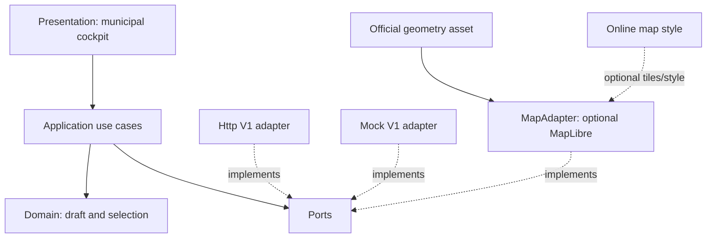
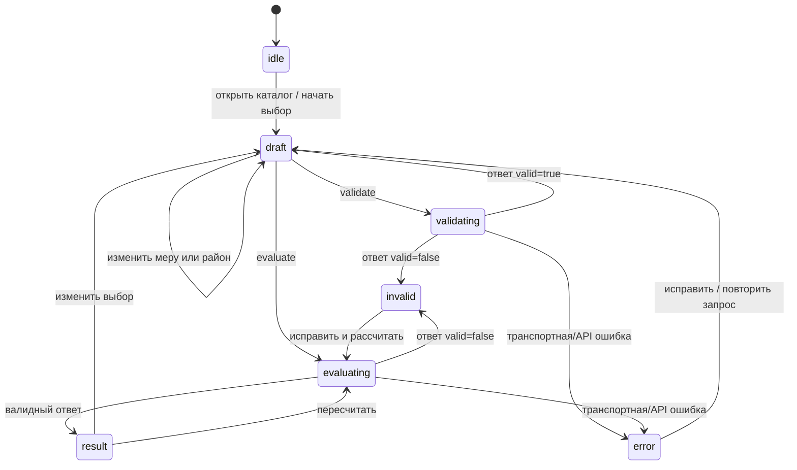
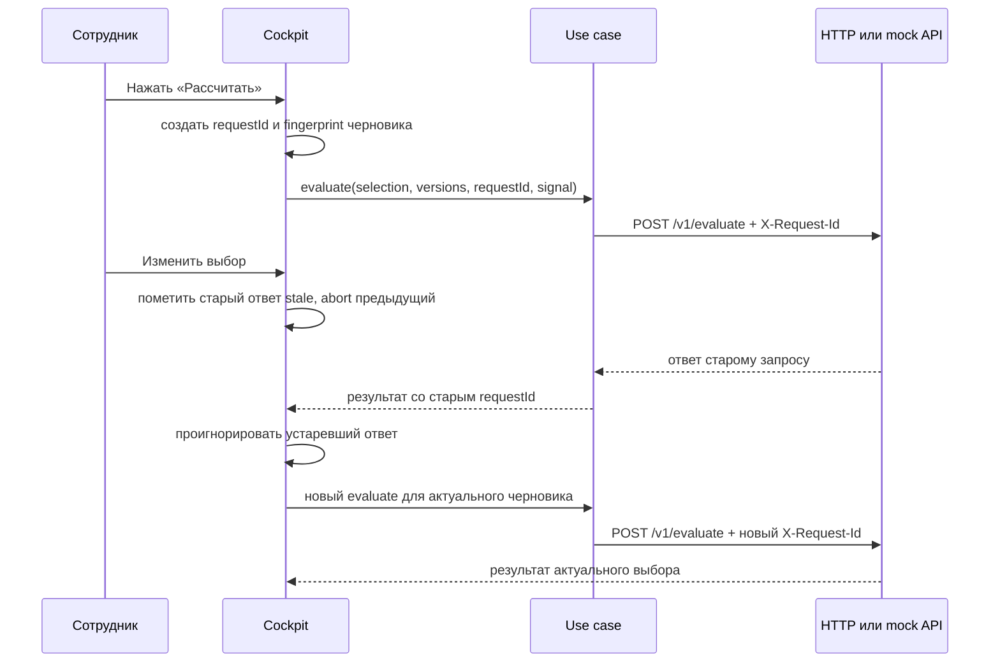

# Архитектура frontend V1

Документ задаёт целевую архитектуру интерфейса акима и сотрудников для пяти решений V1.
Это проектная схема, не утверждение о состоянии реализации. Источник чисел и допустимости
портфеля — API; браузер отвечает за черновик, команды, навигацию и представление ответа.

## Границы и зависимости

Слои направлены внутрь: presentation вызывает application use cases, use cases зависят
от domain и портов, а инфраструктурные адаптеры реализуют порты. Domain не импортирует
React, HTTP, MapLibre или данные демо. API DTO преобразуются в модели приложения на
границе инфраструктуры.



Domain хранит изменяемый черновик: выбранные меры, район для районной меры и текущие
версии каталога. Он может считать локально только очевидное состояние формы (например,
слоты и выбранные ID), но не цену, Score, допустимость, блокировки и прогноз результата.
Правила, числовые показатели и окончательные сообщения о нарушениях принадлежат API.

## Порты и use cases

| Use case | Вход | Выход/эффект |
|---|---|---|
| `loadCatalog` | запрошенная версия или текущая | версии, районы, показатели, меры, правила |
| `validate` | черновик и версии каталога | серверная допустимость, issues, стоимость и остаток |
| `evaluate` | черновик и версии каталога | полный точный результат V1 или issues |
| `findAlternatives` | черновик, закреплённые решения, ограничения поиска | проверенные API альтернативы и статус поиска |

Application зависит от узких портов:

```typescript
interface V1ApiPort {
  loadCatalog(options?: { catalogVersion?: string; signal?: AbortSignal }): Promise<CatalogResponse>;
  validate(request: SelectionRequest, options?: RequestOptions): Promise<ValidateResponse>;
  evaluate(request: SelectionRequest, options?: RequestOptions): Promise<EvaluateResponse>;
  findAlternatives(request: AlternativesRequest, options?: RequestOptions): Promise<AlternativesResponse>;
}

interface MapPort {
  selectDistrict(districtId: DistrictId | null): void;
  onDistrictSelect(listener: (districtId: DistrictId) => void): () => void;
  setDistrictValues(values: ReadonlyMap<DistrictId, number>): void;
  destroy(): void;
}

interface RequestOptions {
  signal?: AbortSignal;
  requestId: string;
}
```

`HttpV1Api` реализует `V1ApiPort` через endpoints контракта из
[`09-frontend-api-contract.md`](09-frontend-api-contract.md). `MockV1Api` реализует
тот же интерфейс для локальной демонстрации, включая задержки, validation issues,
ошибки и golden-результат. Это позволяет переключать mock/backend одним конфигом
`VITE_API_BASE_URL` (пустое или `mock://` значение выбирает mock; HTTP URL выбирает
backend) без изменений компонентов и сценария use case. Оба адаптера должны сохранять
тот же DTO-контракт; mock не является альтернативной формулой бизнес-правил.

`MapAdapter` инкапсулирует выбор района и окраску по серверным значениям. Предпросмотр
frontend строится на настоящей интерактивной MapLibre карте Астаны и использует Mock API,
пока backend не подключён. Районная геометрия должна поступать из официального asset и
связываться с каталогом по стабильному ID; схематическую нарисованную от руки карту нельзя
выдавать за географическую. MapLibre подключается лениво внутри адаптера, поэтому карта
и конкретный источник геометрии не являются жёсткой зависимостью, блокирующей V1:
если asset или карта недоступны, интерфейс остаётся работоспособным со списком районов и
схематичным fallback. Стиль/тайлы базовой подложки могут загружаться из настроенного online style;
если он недоступен, интерфейс оставляет тематические полигоны и подписи без подложки.
Текущий репозиторий содержит исходный табличный датасет и зависимость MapLibre в web
package, но наличие официального геофайла и соответствие его ID здесь не подтверждаются:
путь к asset и маппинг требуется сверить с владельцем данных перед подключением.

## Состояния сценария

Сценарий управляется одним редьюсером/машиной состояний. Черновик остаётся доступен при
сетевой ошибке и во время повторной попытки.



Состояние хранит `catalog`, `draftSelections`, `phase`, issues/error, активный `requestId`
и последнее принятое значение запроса. `invalid` — успешный ответ сервера с нарушениями;
`error` означает проблему транспорта, протокола или сервера. Панель результата отображает
только `EvaluateResponse`, соответствующий текущему черновику и версиям. После изменения
черновика старый ответ немедленно помечается устаревшим и скрывается или явно обозначается
как результат предыдущего выбора.

## Защита от устаревших ответов

Для каждой операции клиент создаёт новый `requestId`, передаёт его заголовком
`X-Request-Id` и запускает `AbortController`. Перед новым запросом той же операции
предыдущий контроллер отменяется. При получении ответа reducer принимает его, только если
совпадают `requestId`, версия каталога и fingerprint черновика; отмена на стороне браузера
не гарантирует остановку сервера. Ошибка abort не показывается как ошибка пользователю.
Ответы с несовпадающим ID игнорируются. Для разных операций (например, validate и
alternatives) request ID независимы, однако изменение выбора инвалидирует все результаты,
которые рассчитаны по старой версии черновика.



## Presentation: municipal cockpit

Главный экран — рабочее место управления, а не аналитическая лаборатория. На первом
уровне видны активная версия снимка, бюджет и остаток, пять слотов решений, список мер
с направлением/ценой/областью действия, выбор района для районной меры и карта-схема
районов. Действия validate, evaluate и поиск альтернатив явные и запускаются человеком.
Результат показывает общий Score, пять районных оценок, критические показатели,
дельты и декомпозицию; рядом остаются версия, issues и стоимость.

Форматированный Score может округляться в представлении, но расчётный DTO сохраняется
без преобразования. Интерфейс не переоценивает Score локально и не заменяет серверные
issues локальными правилами. AI-советник, редактор города, совет/голосование, таймлайн
симуляции, мультигородской выбор и долгоживущий кэш не входят в этот frontend V1.

## Загрузка, ошибки и доступность

- При загрузке каталога показывается скелетон/индикатор, недоступные команды имеют
  `disabled` состояние и доступное пояснение. Повтор загрузки сохраняет черновик только
  если версии совпадают; при новой версии интерфейс явно просит обновить расчёт.
- HTTP ошибки преобразуются в типизированную ошибку адаптера с `code`, `message`,
  `requestId`, `retryable` и `details`. Для `RATE_LIMITED` учитывается `Retry-After`, если
  сервер его возвращает. Сетевая ошибка и таймаут дают действие «Повторить»; ошибки
  выбора остаются рядом с конкретным слотом/полем.
- Сообщения об ошибках и результате доступны через `aria-live` с умеренной вежливостью;
  фокус переводится к сводке issues после отправки невалидного выбора, но не скачет при
  каждом обновлении полей. Все команды доступны с клавиатуры, фокус видим, цвет не
  является единственным носителем критичности, а карте соответствует синхронный список
  районов и текстовые значения.
- При недоступном стиле/геометрии карта показывает спокойный fallback, а не бесконечный
  loader. Текстовый список остаётся основным полноценным способом выбрать район.

## Предлагаемая структура папок

```text
apps/web/src/
  domain/
    draft.ts                 # типы состояния выбора; никаких API и UI импортов
    selection.ts             # команды изменения черновика без расчёта результата
  application/
    ports/
      v1-api.ts              # V1ApiPort
      map.ts                 # MapPort
    use-cases/
      load-catalog.ts
      validate.ts
      evaluate.ts
      find-alternatives.ts
    scenario-machine.ts      # idle/draft/validating/invalid/evaluating/result/error
  infrastructure/
    http-v1-api.ts           # DTO transport и перевод ошибок
    mock-v1-api.ts           # demo adapter по тому же интерфейсу
    maplibre-adapter.ts      # ленивый optional MapLibre + geometry/style
  presentation/
    cockpit/
      MunicipalCockpit.tsx
      DecisionSlots.tsx
      MeasureCatalog.tsx
      DistrictMap.tsx
      BudgetSummary.tsx
      ValidationSummary.tsx
      EvaluationResult.tsx
      AlternativesPanel.tsx
```

Это ориентир модулей, не обязательное соответствие текущим файлам и не требование
создавать пустые слои заранее. Если реализация остаётся компактной, use cases и reducer
можно держать рядом, сохраняя направление зависимостей и контракт портов.
